# CycleVania — Implementation Plan

This folder is the **complete, milestone-by-milestone build plan** for the design specified in
[`../redesign/`](../redesign/README.md). The redesign suite is the *what and why*; this suite is
the *in what order, in which files, verified how*. Where anything here seems to conflict with the
redesign suite, **the redesign suite wins** — stop and ask the maintainer rather than improvising.

The plan is written to be executed by an implementing agent (Sonnet/Opus-class, medium–xhigh
effort) one milestone at a time, without needing any context beyond: this folder, the redesign
folder, and the repository itself.

## Ground rules (read before every session)

1. **The legacy codebase is dead — and useful.** Everything currently under `packages/` (and the
   old `Docs/*.md`, `Docs/dev/`, `Docs/redesign/`) is committed legacy. M00 deletes `packages/`
   and rebuilds from scratch. Legacy code remains retrievable from git history
   (`git log --oneline` to find the last pre-implementation commit, then
   `git show <commit>:packages/core/src/<path>`), and several milestones name specific legacy
   files as **porting references** — proven code worth adapting. On any difference between legacy
   behavior and the redesign spec, the spec wins.
2. **Never commit.** At the end of every milestone: green verification, then STOP and hand off.
   The maintainer reviews and commits. This applies to every milestone, no exceptions.
3. **Never edit the redesign docs.** If a spec gap or contradiction blocks you, stop and ask the
   maintainer (AskUserQuestion) — do not invent a resolution, do not patch the spec.
4. **Determinism law is absolute** ([redesign 02](../redesign/02-determinism.md)): no
   `Math.random`, no host trig (`Math.sin/cos/tan/atan2`) anywhere in `packages/core/src` or
   `packages/examples/src`. `Math.floor/sqrt/hypot/abs/min/max/imul/exp` are allowed. The M00
   guard test enforces this from day one — keep it green.
5. **Tests run from the repo root.** Always `pnpm test` / `npx vitest run <filter>` from the
   repository root, never from inside a package (running vitest from a package directory
   duplicates the workspace path and fails with a bogus "non-existing file" error).
6. **One-shot verification only.** Never leave a Vite dev/preview server or a browser running in
   the background. For Inspector screenshots: build, launch a headless browser once with a temp
   profile (`--user-data-dir` pointing at a temp dir), screenshot, **view the screenshot**, kill
   the browser and the server immediately.
7. **Keep geometry tests small.** Anything decided at L1/L2 is tested with geometry off. Geometry
   suites use low depth, small dims, few seeds. Exactly one benchmark test may be big (M14).
8. **TypeScript is strict with `noUncheckedIndexedAccess`.** Known safe patterns (use them,
   don't fight the checker with `!`):
   - Never index a tuple/array with a runtime variable expecting a non-optional result —
     destructure instead, or write a small helper that takes the components as literal-indexed
     arguments (see the `cr()` Catmull–Rom pattern in M06).
   - Accumulate forces/sums in object properties (`body.fx += …`), not `Float64Array[i] += …`.
   - `for (const x of arr)` and `arr.map` give non-optional elements; prefer them over `arr[i]`.
9. **Effort calibration.** At medium effort: follow phases literally — every public type, function
   signature, algorithm, and test assertion you need is either in this folder or in the named
   redesign doc sections; read them fully before writing code. At high+ effort: you may improve
   *internal* implementation details, but never public shapes, fork labels, rounding rules,
   defaults, file layout, or test assertions — those are contractual.

## Repository conventions (established in M00, binding thereafter)

- pnpm monorepo; packages consumed as **TS source** (`"main": "./src/index.ts"`, no build step);
  relative imports use `.js` specifiers (`./rule.js` resolving to `rule.ts`).
- `@cyclevania/core` has **zero runtime dependencies**. Three.js/Vite live only in
  `@cyclevania/inspector`; the CLI may use Node builtins only.
- One barrel per module (`index.ts`) re-exporting its public surface; `core/src/index.ts` is the
  single public API of the package. Tests live next to code as `<module>.test.ts`.
- Every milestone ends with: `pnpm -r typecheck` green + `pnpm test` green (full suite, from
  root) + that milestone's Definition of Done checklist fully satisfied.

## Milestone map

```mermaid
flowchart LR
  M00[M00 scaffold + math] --> M01[M01 logic + graph]
  M01 --> M02[M02 fill + templates]
  M02 --> M03[M03 world + pacing]
  M03 --> M04[M04 capabilities + puzzles + registries]
  M04 --> M05[M05 spatial skeleton L2]
  M05 --> M06[M06 volume + anchors L3]
  M06 --> M07[M07 finish pass L4]
  M07 --> M08[M08 descriptors + end-to-end]
  M08 --> M09[M09 simulation]
  M08 --> M10[M10 orchestration]
  M09 --> M11[M11 examples + presets]
  M10 --> M11
  M11 --> M12[M12 inspector]
  M11 --> M13[M13 CLI]
  M12 --> M14[M14 final verification]
  M13 --> M14
```

| Milestone | Doc | Builds | Rough scope |
|---|---|---|---|
| M00 | [M00-scaffold-and-math.md](./M00-scaffold-and-math.md) | fresh monorepo + `core/src/math` + determinism guard | ~12 files, mostly ported |
| M01 | [M01-logic-and-graph.md](./M01-logic-and-graph.md) | `logic/`, `graph/` | ~8 files |
| M02 | [M02-fill-and-templates.md](./M02-fill-and-templates.md) | `fill/`, `template/` | ~8 files |
| M03 | [M03-world-and-pacing.md](./M03-world-and-pacing.md) | `world/` | ~9 files |
| M04 | [M04-capabilities-puzzles-registries.md](./M04-capabilities-puzzles-registries.md) | `capability/`, `puzzle/`, `registries/` + world wiring | ~12 files |
| M05 | [M05-spatial-skeleton.md](./M05-spatial-skeleton.md) | `skeleton/` | ~7 files |
| M06 | [M06-volume-and-anchors.md](./M06-volume-and-anchors.md) | `volume/`, `anchors/` | ~10 files |
| M07 | [M07-finish-pass.md](./M07-finish-pass.md) | `finish/` | ~7 files |
| M08 | [M08-descriptors-and-pipeline.md](./M08-descriptors-and-pipeline.md) | `descriptors/` + the full pipeline wired | ~6 files |
| M09 | [M09-simulation.md](./M09-simulation.md) | `sim/` | ~7 files |
| M10 | [M10-orchestration.md](./M10-orchestration.md) | `orchestration/` | ~6 files |
| M11 | [M11-examples-and-presets.md](./M11-examples-and-presets.md) | `@cyclevania/examples`: 3 presets + MP fixtures | ~12 data files |
| M12 | [M12-inspector.md](./M12-inspector.md) | `@cyclevania/inspector` (4 phases) | the largest milestone |
| M13 | [M13-cli.md](./M13-cli.md) | `@cyclevania/cli` | ~7 files |
| M14 | [M14-final-verification.md](./M14-final-verification.md) | invariant sweep, perf budgets, acceptance | tests + fixes only |

Milestones must be executed **in numeric order**, with two exceptions: M09/M10 may swap freely,
and M12/M13 may swap **only if** M13's Phase 13.2 (the reproduction-bundle shapes in
`core/src/descriptors/bundle.ts`) is executed first — M12's Phase 12.4 depends on it. Never
start a milestone while the previous one's verification is red.

## The per-milestone execution protocol

1. Read this README, the milestone doc, and every redesign doc listed in its **Required
   reading** — fully, before writing any code.
2. Confirm prerequisites: `pnpm -r typecheck && pnpm test` green at the current state.
3. Execute the phases in order. After each phase, run that phase's verification before moving on.
4. Write each phase's tests in the same phase as its code — never deferred.
5. On completion: walk the **Definition of Done** checklist literally; run the full root
   verification one-shot; fix anything red before declaring done.
6. Report what was built and verified, then **STOP and hand off** (no commit).
7. Blocked or ambiguous → ask the maintainer. Wrong-feeling spec → ask, don't patch.
