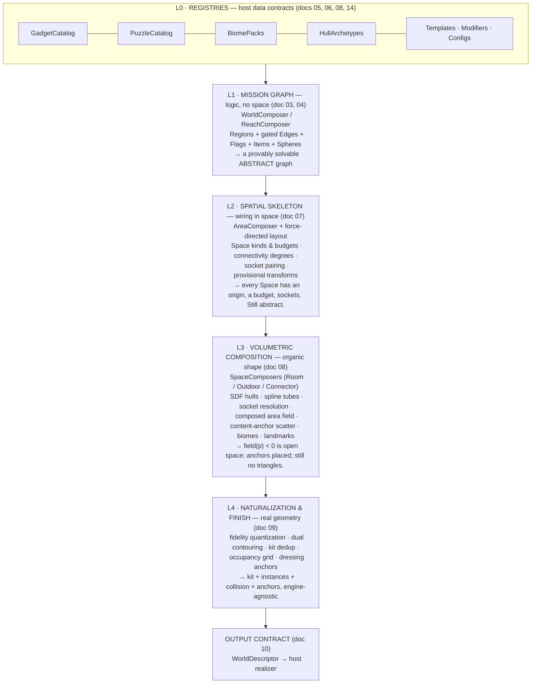
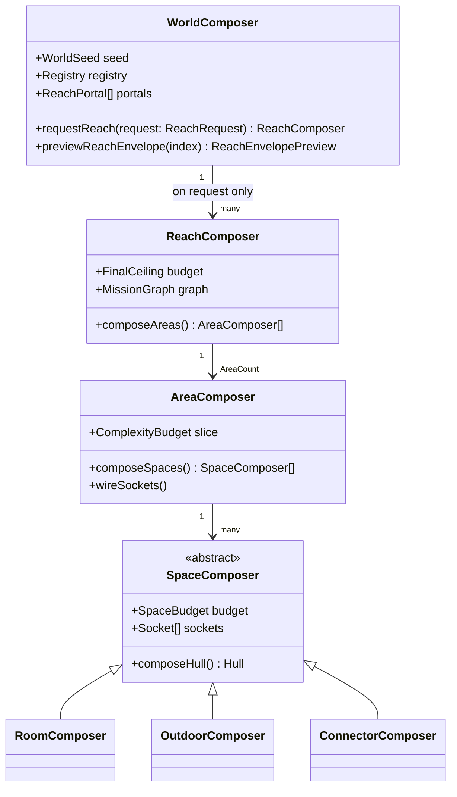

# 01 · Architecture — the five layers and the master order of operations

## Why layers, and why these five

Solving progression logic, spatial layout, and organic shape *simultaneously* is what produces
boxy, samey, "proc-genny" levels — the generator fights itself trying to satisfy solvability and
geometry constraints in one pass. Separating them means each layer gets the *right* algorithm and
cannot corrupt the guarantees of the layer below it. **Solvability is fixed forever in L1 and never
touched again** — everything from L2 onward makes choices about space and beauty without ever being
able to break "can the player finish."



Two cross-cutting subsystems sit beside the pipeline, consuming its output:

- **Simulation** ([11](./11-simulation-and-autosolve.md)) — a deterministic playtest reducer over
  the abstract layers (L1/L2 facts only), proving every generated Reach is completable by actually
  walking it.
- **Orchestration** ([12](./12-orchestration-and-host-integration.md)) — the async facade
  (cancellation, progress, horizon prefetch, worker offload) around the pure synchronous cores.

## The composer hierarchy

Composers are the only stateful actors — everything else (registries, rules, SDFs, meshers) is
pure data or pure functions, which is what keeps the pipeline deterministic and testable in
isolation.



| Composer | Layer | Owns / decides | Never decides |
|---|---|---|---|
| `WorldComposer` | L1 | `WorldSeed`; realized Reaches; `WorldLengthPolicy` draw; virtual schedules; previews; `ReachPortal[]` | any coordinate, any geometry |
| `ReachComposer` | L1 | one Reach's `MissionGraph` (template interpretation, gating, loops); `FinalCeiling`; item/puzzle selection for this Reach; `assumedFill` | how Regions look or sit in space |
| `AreaComposer` | L2 | one Region → one Area: Space count/kinds (incl. **outdoor**), budgets, force-directed positions, connectivity degrees, socket pairing, connector plans, biome assignment, recipe envelopes, landmark slots | what any hull actually looks like |
| `RoomComposer` / `OutdoorComposer` / `ConnectorComposer` | L3 | one Space's hull SDF, resolved socket transforms, content-anchor scatter | solvability, gating, budgets |
| *(the finish pass — a pure function, not a composer)* | L4 | meshing, fidelity, kit, occupancy, dressing | **everything structural** — L4 is strictly a finishing pass |

## Separation-of-concerns matrix

The load-bearing invariants, stated as "may read / must never touch":

| Layer | May read | Must never touch |
|---|---|---|
| L0 registries | — (pure data, validated once) | anything generated |
| L1 | registries, `startHeld` (concrete carried state), RNG forks | coordinates, hulls, geometry |
| L2 | the L1 graph + placement, budgets, capability **bucket aggregates** | Rules' truth values (it may *carry* gates onto sockets, never re-evaluate placement) |
| L3 | L2 skeleton (positions, budgets, socket pairs, biome), registries | the mission graph's structure; item placement |
| L4 | the composed field + L3 anchors + fidelity config | *any* decision — it converts, classifies, and exports only |
| sim | L1 graph + L2/L3 abstract facts (sockets, anchors, gates) | geometry buffers (Play-mode collision uses the occupancy grid, which is L4 *output*, read-only) |
| host realizer | the output contract ([10](./10-output-contract.md)) | CycleVania internals |

## The master order of operations

This is the definitive end-to-end sequence for realizing one Reach. Earlier design layers left the
L2→L3 hand-off (socket positions before hulls exist — a chicken-and-egg) underspecified; steps 8–12
below resolve it precisely.

```mermaid
flowchart TB
  A["1 · ReachRequest arrives\n(reachIndex, chosenModifiers, overrides)"] --> B["2 · resolve template\n(request override, or a seeded draw from ReachTemplatePool)"]
  B --> C["3 · compute FinalCeiling\n(tier curve + entropy + lookbehind + modifier patch — doc 04)"]
  C --> D["4 · select this Reach's items & puzzles\n(schedulers + virtual-schedule bias + pity + final sweep — docs 05, 06)"]
  D --> E["5 · interpret template (+ structure nudges)\ninto a concrete MissionGraph; BIND gate rules from the\nselected content (teach→test→combine pacing); draw AreaCount"]
  E --> F["6 · validateGraph(graph, startHeld ∪ selected items) — throws on a stranded Region"]
  F --> G["7 · assumedFill(graph, startHeld, items)\n→ Sphere-ordered placement; solvability now constructed, forever"]
  G --> H["8 · per Region: AreaComposer\nSpace count/kinds (Room/Outdoor), budget split + pooling, recipe envelopes"]
  H --> I["9 · force-directed layout\n→ Space origins + bounding envelopes (no overlaps)"]
  I --> J["10 · socket pairing\ndegree roll · signature match · PROVISIONAL transforms on envelope boundaries"]
  J --> K["11 · per Space: SpaceComposer.composeHull()\nSDF archetype pick + noise + recipe carve-ins"]
  K --> L["12 · socket RESOLUTION\nproject provisional sockets onto hull surfaces · snap basis to fidelity grid"]
  L --> M["13 · connectors\nspline tubes between resolved socket pairs · smooth-union into the area field"]
  M --> N["14 · content-anchor scatter\nsurface classify · Poisson-disk · bind fill/puzzle placements to anchors"]
  N --> O["15 · finish pass (if geometry enabled)\ndual contour → quantize → kit dedup → occupancy → dressing"]
  O --> P["16 · assemble descriptors + meta\n(seed, fingerprint, request identity, version) → output"]
```



Rules the sequence must obey:

- **Steps 1–5 decide shape; 6–7 construct and prove solvability.** Selection (step 4) runs
  *before* interpretation (step 5) because gate rules must reference the selected content — a
  graph whose gates aren't bound yet cannot be validated. Nothing after step 7 may alter the
  graph, gating, or placement. If a later step *needs* a change (it can't — see GenError
  taxonomy, [12](./12-orchestration-and-host-integration.md)), that's a design bug.
- **Step 8 decides all abstract Space facts** — including which Spaces are outdoor, which host a
  landmark, and which reserve a recipe envelope. L3 realizes those facts; it never invents them.
  (An earlier implementation let the geometry pass decide outdoor-ness; that inversion caused both
  a design smell and a test-cost explosion, and is explicitly forbidden here.)
- **Sockets have two lifecycle stages**: *provisional* (step 10 — a position on the Space's
  bounding envelope, facing its partner, sufficient for connector planning and validation) and
  *resolved* (step 12 — projected onto the actual hull surface along its direction via
  sphere-marching the SDF, orientation basis snapped to the fidelity grid). All output carries
  resolved sockets; provisional transforms never leak out.
- **The finish pass is optional per call** (`geometry: false` skips step 15) so bulk solvability
  soaks and logic-only tooling stay fast. Everything through step 14 always runs; the output
  remains complete and simulatable without geometry.
- Steps 8–15 run **per Area, independently**, each from its own RNG fork — Areas are
  parallelizable and streamable units by construction.

## Module layout

The recommended package/module structure. Names are normative for the implementation plan; the
mapping to proven prior code (rightmost column) tells the implementer what can be ported nearly
as-is versus written fresh.

```
packages/
├─ core/          @cyclevania/core — zero runtime deps, engine-agnostic, deterministic
│  └─ src/
│     ├─ math/           rng · trig · noise · qef · vec · geom · curve · golden/
│     ├─ logic/          rule · held
│     ├─ graph/          mission-graph · reachability · spheres · solvable · validate
│     ├─ fill/           assumed-fill · placement-weights · sweep
│     ├─ template/       reach-template · template-pool · interpret
│     ├─ world/          world-composer · reach-request · modifiers · length-policy ·
│     │                  complexity · preview · virtual-schedule · portals
│     ├─ capability/     capability-def · facets · buckets · gadget-scheduler · economy
│     ├─ puzzle/         puzzle-def · outcomes · recipes · lock-vocabulary · puzzle-scheduler
│     ├─ registries/     define-registry · validation · vocabulary · all config shapes
│     ├─ skeleton/       area-composer · space-budget · degrees · force-layout · socket-wiring
│     ├─ volume/         sdf · hulls · outdoor · spline · field · biome-blend
│     ├─ anchors/        surface-classify · scatter · anchor-kinds · landmarks
│     ├─ finish/         fidelity · mesher · kit · occupancy · collision · dress
│     ├─ descriptors/    output shapes · assemble · serialize · meta
│     ├─ sim/            state · command · parser · reducer · autosolve
│     ├─ orchestration/  async facade · cancellation · horizon · worker-adapter · errors
│     └─ index.ts        the public API surface
├─ examples/      @cyclevania/examples — shipped datasets: the three presets (doc 14),
│                 the Metroid Prime-scale fixture set (doc 15), demo catalogs
├─ inspector/     @cyclevania/inspector — Vite + Three.js dataset workbench (doc 13)
└─ cli/           @cyclevania/cli — headless generate/validate/soak/report/diff (doc 13)
```

| New module | Prior code that proves it (port candidates) | Status |
|---|---|---|
| `math/` | existing `core/src/math/*` (Rng, trig, noise, qef, golden vectors) | port as-is |
| `logic/`, `graph/`, `fill/` | existing modules (1000-seed soak green) | port; extend fill with weighting + sweep |
| `template/` | existing `template/grammar.ts` | port; add `ReachTemplatePool` |
| `world/` | — (new: ReachRequest, modifiers, previews, schedules) | write fresh per doc 04 |
| `capability/`, `puzzle/` | — (Facet/PuzzleDef model is new) | write fresh per docs 05–06 |
| `skeleton/` | existing `layout/forcedirect.ts`; parts of `composers/area-composer.ts` | port layout; rewrite composer |
| `volume/` | existing `volume/{sdf,hulls,spline,field}.ts` | port; add outdoor + biome-blend + socket resolution |
| `anchors/` | — (Poisson scatter is new; `geometry/dress.ts` informs it) | write fresh per doc 08 |
| `finish/` | existing `geometry/{fidelity,mesher,kit,collision,dress}.ts` | port with fidelity-profile generalization |
| `sim/` | existing `sim/*` | port; extend commands per doc 11 |
| `orchestration/` | existing `orchestration/*` | port; rework horizon around ReachRequest |

## Suggested build order (sketch)

The full implementation plan follows separately; the dependency-driven order is: `math` →
`logic`/`graph`/`fill` → `template` → `world` (complexity, requests, previews, schedules) →
`capability`/`puzzle` schedulers → `skeleton` → `volume`/`anchors` → `finish` → `descriptors` →
`sim` → `orchestration` → examples/presets → inspector → CLI. Each stage is fully testable before
the next begins ([15](./15-verification-and-test-strategy.md)); a stage never depends on one after
it.
