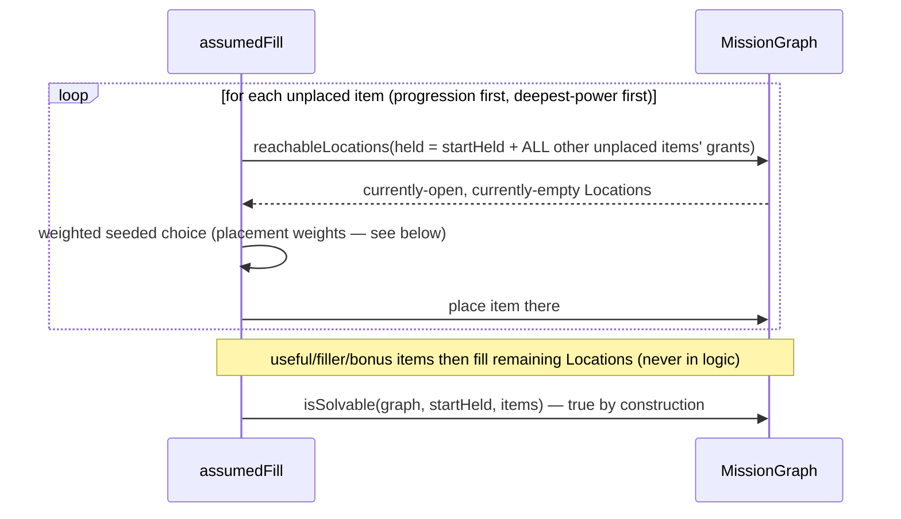
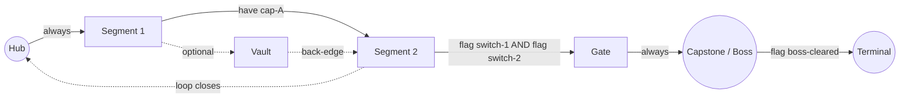

# 03 · Mission graph (L1 — logic, no space yet)

> Adapts the Archipelago randomizer's formal model — **Regions**, **Locations**, **Items**,
> **Spheres** — into a self-contained logic layer that produces a *provably solvable* abstract
> graph before a single coordinate exists. This layer is the foundation everything else trusts;
> nothing above it can break what it proves.

## Vocabulary

| Term | Meaning |
|---|---|
| **Region** | A node in the mission graph; maps 1:1 onto exactly one Area in L2. A Reach's Region count is a ranged, weighted draw (`AreaCountConfig`, [04](./04-worlds-reaches-and-pacing.md)) — "1:1" describes the mapping, not the count. |
| **Location** | A placeable slot inside a Region (a pedestal, a switch, a chest). |
| **Item** | Something placed at a Location. Classed `progression \| useful \| filler \| bonus`. |
| **Capability** | An opaque host-defined id a progression Item grants ([05](./05-capabilities-and-facets.md)). |
| **Rule** | Gates an edge or Location: `always · have · count · flag · and · or · not`. |
| **Flag** | A named boolean world fact set by solving something — **first-class on the graph**, with provenance, because multi-room puzzles need a flag set in one Region to gate an edge in another ([06](./06-puzzles-locks-and-recipes.md)). |
| **Sphere** | The solvability ladder: Sphere 0 = reachable with starting state; Sphere *n* = reachable once everything from Spheres < *n* is held. |
| **Held** | A concrete state snapshot: capabilities (with counts/levels) + flags. |

## The Rule algebra

```ts
type Rule =
  | { k: "always" }
  | { k: "have"; cap: CapabilityId }          // hold the capability at any level
  | { k: "count"; cap: CapabilityId; n: number } // hold ≥ n grants of it (multi-key, or "level ≥ n")
  | { k: "flag"; name: string; volatile?: boolean } // a world fact is set (volatile: see 06)
  | { k: "not"; of: Rule }
  | { k: "and"; of: Rule[] }
  | { k: "or"; of: Rule[] };
```

Evaluation semantics (`evalRule(rule, held): boolean`) are the obvious structural recursion, with
two contract-level notes:

- **`missingCaps(rule, held): CapabilityId[]`** returns the *unmet subset* of a compound gate. This
  exists for "remembered locks" UI — an A∧B door must never display just one "primary"
  requirement. It's part of the public API, not an internal helper.
- **Derived capabilities** ([05](./05-capabilities-and-facets.md)): `have(x)` where `x` is
  `held: { derivedFrom: [...] }` evaluates against the derivation, transparently — the graph layer
  needs no special case beyond resolving derived membership when building `Held`.
- **Volatile flags** (`volatile: true`) are excluded from the baseline solvability evaluation —
  see the hard rule in [06](./06-puzzles-locks-and-recipes.md): a volatile flag may only ever gate
  optional content.

## The graph itself

```ts
interface Region { id: string; role: NodeRole; }
interface Edge   { from: string; to: string; rule: Rule; oneWay?: boolean; }
interface FlagDef { name: string; setBy: LocationId | PuzzleId; volatile?: boolean; }

interface MissionGraph {
  regions: Region[];
  edges: Edge[];                       // directed; a two-way link is two edges (or oneWay: false sugar)
  flags: FlagDef[];                    // first-class, with provenance
  locations: Map<LocationId, RegionId>;
  start: RegionId;
}
```

### Reachability — the one primitive everything reduces to

`reachableRegions(graph, held): Set<RegionId>` is a fixed-point BFS:

```
frontier ← { graph.start } ; reached ← { graph.start }
repeat until no change:
  for each edge e with e.from ∈ reached and e.to ∉ reached:
    if evalRule(e.rule, held): add e.to to reached
return reached
```

Directedness handles one-way drops for free: a drop is an edge with no reverse partner.
`reachableLocations(graph, held)` filters `locations` by reached Regions (plus per-Location rules,
if a Location carries its own gate).

### Spheres

`computeSpheres(graph, startHeld, placement)` iterates: evaluate reachability under the current
`Held`; collect every newly-reachable placed Item; fold their grants/flags into `Held`; repeat
until a pass collects nothing. Output: `SphereResult = { spheres: LocationId[][], heldPerSphere }`.
The sphere index of every placement is recorded into descriptors (the Inspector's sphere ladder and
the host's hint systems both read it).

### Solvability & validation

- **`isSolvable(graph, startHeld, items): boolean`** — every progression capability introduced by
  `items` is collectible AND every non-`bonus` Location is reachable once fully equipped, starting
  from `startHeld`. This is the zero-softlock guarantee.
- **`validateGraph(graph, fullyEquippedHeld): void`** — construction-time precondition: every
  Region must be reachable when holding `startHeld` + everything this Reach will place. Failure
  throws with a precise diagnostic (**which** Regions are stranded, **which** edge rules were the
  last unsatisfiable frontier) — a malformed template is a bug, not runtime input, so it fails
  loudly at generation time, never silently at play time.

## Solvability is scoped to exactly one Reach at a time

"Generated on demand" and "provably solvable" look like they conflict until the boundary is placed
precisely: **one `requestReach` call materializes one complete `MissionGraph`** — every Region and
Location for *that* Reach, all at once. The lazy part ([04](./04-worlds-reaches-and-pacing.md)) is
about the relationship *between* Reaches, never within one.

```ts
function validateGraph(graph: MissionGraph, startHeld: Held): void;
function assumedFill(graph: MissionGraph, startHeld: Held, items: Item[]): Placement;
```

`startHeld` is **`Held`, not `Rule`** — a concrete, already-fixed snapshot of every
capability/flag carried forward from Reaches `0..i−1`, which are fully realized by the time Reach
`i` is requested (the host trigger that issues a request necessarily lives inside an
already-realized Reach). The induction:

- Reach 0 is solvable standalone (`startHeld = ∅` + registry `startCaps`).
- Reach *i* is solvable given Reach *i−1*'s already-concrete carried state.
- Therefore every realized prefix of the World is solvable — with no step ever depending on
  something that doesn't exist yet. There is deliberately **no whole-World graph and no whole-World
  solvability proof**; the concept isn't needed for the guarantee to hold.

This also does **not** mean a Reach places the whole registry: content pools stretch across the
World per the virtual schedules ([04](./04-worlds-reaches-and-pacing.md)); "every other unplaced
item" below means unplaced *within this Reach's own item list*.

## Assumed fill — solvability constructed, not checked

The core trick that eliminates retry loops entirely. Run once per Reach against its own graph and
its `startHeld`:



1. To place the **next** item, assume the party already holds **every other unplaced** item from
   this Reach *plus* everything in `startHeld`.
2. Find every currently-empty, currently-reachable Location under that assumption.
3. Drop the item into one, by a weighted seeded choice (weights below).
4. Repeat until every item is placed; then fill non-progression items into what remains.

Because each item is only ever gated behind items placed **after** it (or already in `startHeld`),
this inductively produces a valid Sphere ordering — a softlock is structurally impossible, not
statistically unlikely. **Counted keys fall out free**: placing the *n*-th copy of a counted
capability assumes only *n−1* held, so the last copy can never hide behind itself — and this same
mechanism *is* progressive-upgrade leveling ([05](./05-capabilities-and-facets.md)).

### Placement weights — the exploration-reward shape

The weighted choice in step 3 is where "organic, rewarding item placement" lives — as a **weighting
over the already-safe location set** (bootstrap safety is untouched; weights can never make an
unsafe choice because unsafe choices are never in the candidate set):

```ts
interface PlacementWeightConfig {
  entrySpaceWeight: number;      // default 0 — progression items never in the Reach's entry Region's hub Locations
  depthExponent: number;         // default 1.5 — deeper (higher-sphere-potential) Locations weighted up
  vaultBonus: number;            // default 2.0 — multiplier for vault/branch Locations
  behindGateBonus: number;       // default 1.5 — multiplier when the Location sits past ≥1 gated edge
  perRegionCap: number;          // default 1 — max progression items per Region (soft: relaxed only if candidates run out)
  sphereSpreadBonus: number;     // default 1.5 — multiplier for Locations whose sphere differs from the last placement's
}
```

Weight of a candidate = product of applicable factors; a hard `0` removes it (unless the candidate
set would empty, in which case caps relax in documented order: `perRegionCap` first, then
`entrySpaceWeight` — and never silently: relaxation is recorded in the Reach's meta). This achieves
the intended feel — never in the entry room, at most one per room, spread across spheres, biased to
vaults and behind gates, organically varied per seed — without ever risking the guarantee.

### Bootstrap invariant

`hub`-roled Regions must offer `≥ (this Reach's progression item count) + 1` always-reachable
Locations, validated at template-interpretation time. This guarantees assumed fill always has a
legal candidate even in the degenerate "everything else is gated" case.

## `ReachTemplate` — the macro-shape, as data

A template never mentions concrete Capabilities — only structure:

```ts
type NodeRole = "hub" | "segment" | "gate" | "vault" | "capstone" | "terminal";

interface ReachTemplate {
  id: string;
  criticalPath: string[];                       // ordered node ids along the spine
  nodes: Record<string, { role: NodeRole; slots: { min: number; max: number } }>;
  branches: BranchSpec[];                       // vaults hung off the spine
  gating: {
    lockFraction: number;                       // fraction of critical-path edges gated
    compoundChance: number;                     // chance a gate is and/or of ≥ 2 requirements
    keepEntryOpen: boolean; keepExitOpen: boolean;
  };
  loops: {
    guaranteeAtLeastOne: boolean;
    density: number;                            // 0..1 — extra shortcut-closure attempts beyond the guarantee
  };
}

interface BranchSpec {
  attachTo: string;                             // a criticalPath node id
  role: NodeRole;                               // usually "vault"
  entrance: "single" | "compound" | "optional-open";
  backEdgeChance: number;                       // chance the branch loops back to the spine
}
```

- `hub` — the entry/save point; hosts the bootstrap Locations.
- `segment` — ordinary critical-path progress.
- `gate` — its entrance edge is always locked (a deliberate checkpoint).
- `vault` — an optional branch; loot-flavored, not required.
- `capstone` — the set-piece. **The last Area of every Reach is always a `capstone`**, and it
  always contains a boss chamber (indoor) or boss arena (outdoor) — which of the two is an L2/L3
  decision, typically biased by biome.
- `terminal` — the hand-off (a `ReachPortal` endpoint, [04](./04-worlds-reaches-and-pacing.md)).

**Interpretation** (`interpretTemplate(template, dials, rng): MissionGraph`) proceeds: instantiate
nodes → wire the spine → hang branches (probabilities nudged by any modifier `dials.structure`,
[04](./04-worlds-reaches-and-pacing.md)) → gate `lockFraction` of spine edges (a `gate` node always
locks its entrance; entry/exit respect `keepEntryOpen`/`keepExitOpen`) → close loops (the
guarantee, then `density`-driven extra attempts) → allocate Location slots per node → then
`validateGraph` + `assumedFill`. Any failure throws.

### `ReachTemplatePool` — templates are drawn, not fixed

For genuine run-to-run variety the World holds a depth-scoped weighted **pool** of templates, not a
single `templateFor(index)` function:

```ts
interface ReachTemplatePool {
  poolAt(depth: number): { template: ReachTemplate; weight: number }[];
}
```

The template for Reach *i* is a seeded weighted draw from `poolAt(i)` (from the Reach's root fork),
overridable per-request ([04](./04-worlds-reaches-and-pacing.md)). Hosts wanting a fixed
progression supply single-entry pools; hand-authored set-piece Reaches (a World-defining finale)
are pinned by supplying exactly one template at that depth.

## Example mission graph (default template shape)



## Edge cases this layer must handle (normative)

1. **Stranded-by-construction** — `validateGraph` runs before fill, with a diagnostic naming the
   stranded Regions and the unsatisfiable frontier rules.
2. **One-way stranding** — a one-way edge into a sub-graph with no rule-satisfiable way onward or
   back is a `validateGraph` failure (reachability-when-fully-equipped covers this; the diagnostic
   calls out the one-way edge specifically).
3. **Bonus purity** — `bonus`-classed Locations are excluded from `isSolvable`'s "every location
   reachable" clause; a `bonus` Location gated on a capability the World never places is legal.
   Conversely, a *progression* item must never be placed in a `bonus`-gated Location (fill filters
   these from the candidate set).
4. **Compound gates surface fully** — every descriptor carrying a gate carries the full `Rule`;
   `missingCaps` gives UIs the complete unmet set.
5. **Counted keys across Reaches** — `count(cap, n)` where earlier Reaches already granted *k*
   copies: fill for this Reach only needs to place `n − k` before the gate is satisfiable; `Held`
   carries counts, not booleans.
6. **Flags across Regions** — first-class `FlagDef.setBy` provenance lets validation confirm every
   flag referenced by any rule has exactly one setter that is itself reachable (an unset-table flag
   in a required rule is a `GenError`).
7. **Self-gating impossibility** — an Item can never gate its own Location (structural consequence
   of assumed fill; asserted anyway in tests as the canary for fill regressions).
