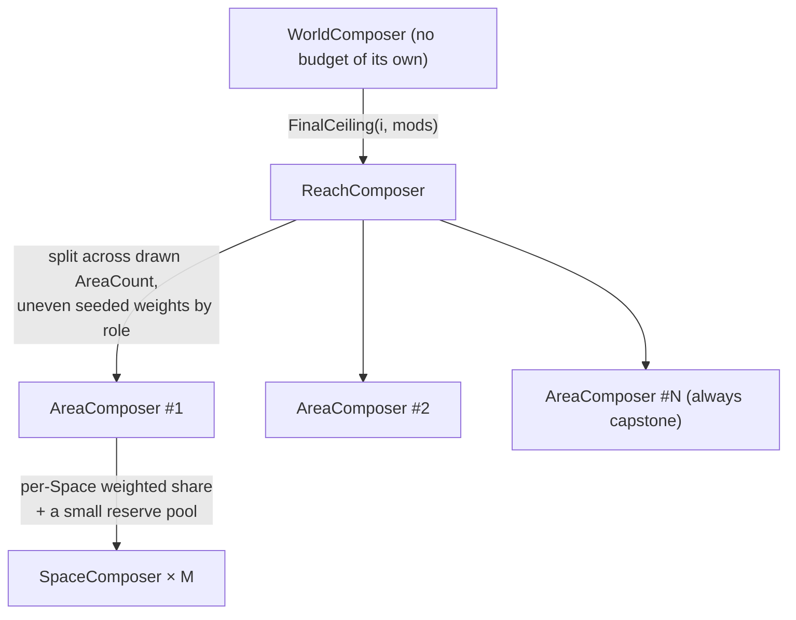

# 04 · Worlds, Reaches & pacing (on-demand generation, budgets, schedules)

> How Worlds hold Reaches without pre-generating them, how a Reach is **requested** (never
> scheduled), how player-chosen **Reach modifiers** and the complexity curve fold into one budget,
> how fixed content pools pace across a World of drawn length, and how cross-Reach navigation
> (ReachPortals) stays separate from solvability.

## Responsibilities, top to bottom

| Composer | Owns | Produces |
|---|---|---|
| `WorldComposer` | `WorldSeed`; the realized-Reach history; `WorldLengthPolicy` draw; virtual schedules; `ReachPortal[]`; previews | Reaches, strictly on request |
| `ReachComposer` | one `FinalCeiling`; one template draw; one `MissionGraph`; item/puzzle selection + `assumedFill` | a solvable Reach handed to L2 |

Worlds and Reaches never carry a literal 3D transform ([00](./00-goals-and-principles.md),
principle 6). A World's spatial bounds are only ever the union of realized Area bounds.

## How many Reaches? — `WorldLengthPolicy`

```ts
interface WorldLengthPolicy {
  min: number;
  max?: number;                    // omit only for a genuinely open-ended World (see trade-off below)
  weights?: (n: number) => number; // uniform by default
}
```

`L` — the World's total Reach count — is drawn **once**, deterministically, from
`rng.fork("world-length")`, the moment the World is configured (before Reach 0 is requested). `L`
is a small, purely *logical* commitment (the same one-time ranged draw `AreaCountConfig` makes per
Reach, one level up); it does not contradict spatial laziness. `min = max = 1` is a fully-supported
degenerate value — the "one single massive Reach" configuration — not a special case.

**Unbounded Worlds** (no `max`): there is no `L`, hence no virtual schedule and no final sweep. The
only cross-Reach guarantee tool left is each entry's own pity window
([05](./05-capabilities-and-facets.md)). That's a genuine trade-off the host opts into, not an
oversight — document it in host-facing tooling whenever `max` is absent.

## How many Areas per Reach? — `AreaCountConfig`

```ts
interface AreaCountConfig {
  min: number;
  max: number;
  weights?: (n: number, ctx: { reachIndex: number; chosenModifiers: ReachModifierId[]; finalCeiling: number }) => number;
}
```

Drawn once per Reach, seeded, the moment `FinalCeiling` is known (so `weights` can react to it).
Shipped default `{ min: 5, max: 5 }` per the calibration philosophy
([14](./14-dial-reference-and-presets.md)); real games flex it hard (a faithful Metroid Prime-scale
Reach needs `{3,3}` Areas of 10–21 Spaces each — see the fixture set,
[15](./15-verification-and-test-strategy.md)).

## Reaches are requested, not scheduled

`WorldComposer` never iterates `reachIndex = 0..N` on its own initiative:

```ts
interface ReachRequest {
  reachIndex: number;               // the slot being realized; validated as a legal next slot
  fromReachIndex?: number;          // the already-REALIZED Reach this request originated from (undefined only for 0)
  chosenModifiers: ReachModifierId[];             // validated against the depth's policy
  template?: ReachTemplate;                       // optional override of the pool draw
  gadgetEconomyOverride?: Partial<GadgetEconomyConfig>;   // host lever at request time (05)
  puzzleEconomyOverride?: Partial<PuzzleEconomyConfig>;   // identical, for the Puzzle pool (06)
}

WorldComposer.requestReach(request: ReachRequest): ReachComposer
```

CycleVania has **no opinion on what triggers a request** — a shrine, a menu, an NPC, a resource
sacrifice — nor what modifiers are called in-fiction. It enforces exactly one structural rule:
`fromReachIndex`, when present, must refer to an already-realized Reach. That single rule supports
both a strict linear chain and a branching structure (several unlocked trigger points, each able to
request a different unrealized slot) purely as a host decision.

## Reach modifiers — player-chosen risk/reward dials

A **Reach modifier** is a data-driven choice made *before* a Reach generates; CycleVania treats it
as a fourth input to budget math it already has — never a separate system:

```ts
type ReachModifierId = string;      // opaque — CycleVania never inspects meaning, only dials

interface ReachModifierDef {
  id: ReachModifierId;
  riskWeight: number;               // 0..1 — how much this can hurt
  rewardWeight: number;             // 0..1 — how much this can pay off
  minDepth: number;                 // first depth it enters the pool
  dials: DialPatch;
  excludesTags?: string[];          // mutual exclusion
  tags?: string[];
}

/** Deltas, never overwrites — the universal "patch a budget" shape. */
type DialPatch = {
  complexity?: { additive?: Partial<ComplexityConfig>; multiplier?: Partial<ComplexityConfig> };
  gadgetEconomy?: Partial<{ min: number; max: number }>;
  puzzleEconomy?: Partial<{ min: number; max: number }>;
  reward?: Partial<{ lootTierBonus: number; bonusLocations: number }>;
  hazard?: Partial<{ densityMul: number }>;
  structure?: Partial<{ extraBranchChance: number; extraLoopChance: number }>; // template-interpretation nudges — seeded, never guaranteed, applied strictly before validateGraph
  custom?: Record<string, number>;  // host-named dials CycleVania weighs generically
};

interface ReachModifierPolicy {
  poolAt(depth: number): ReachModifierDef[];            // filters catalog by minDepth ≤ depth
  requiredRange(depth: number): { min: number; max: number };  // the optional → mandatory ramp
}
```

`requiredRange` is how a host builds an "informed player choice inside an algorithmic envelope"
difficulty ramp: optional at shallow depths, ≥1 mandatory mid-game, ≥2 (with high-risk entries
unlocked) late. Both ramps — this one and the ambient entropy curve below — exist at once.

**A modifier is not a Gadget.** A Gadget changes what the *player* can do (Facets the graph gates
on); a modifier changes what the *generator's dials* are for one Reach. A Gadget is found during a
Reach and persists; a modifier is chosen before one and applies once.

## The complexity formula

```ts
ReachLevel(i)      = floor(i / TIER_SIZE);
ExpectedCeiling(i) = BaseCeiling * (1 + K_MUL * ReachLevel(i)) + K_ADD * i;
jitter             = triangular(rng.fork(`reach-entropy:${i}`), -JITTER_FRAC, +JITTER_FRAC) * ExpectedCeiling(i);
ActualCeiling(i)   = clamp(lerp(ExpectedCeiling(i), RealizedCeiling(i-1), LOOKBEHIND_PULL) + jitter,
                           MIN_CEILING, HARD_MAX);

// the player-chosen fourth term:
additive   = Σ chosenModifiers[].dials.complexity.additive
multiplier = Π (1 + chosenModifiers[].dials.complexity.multiplier)
FinalCeiling(i, mods) = clamp(ActualCeiling(i) * multiplier + additive, MIN_CEILING, ABSOLUTE_HARD_MAX);
```

- The tier curve gives deliberate plateaus (`TIER_SIZE` Reaches per level) instead of a monotone
  grind; `K_ADD` adds a gentle within-tier slope.
- The entropy jitter (triangular, so mid values are likelier than extremes) makes adjacent Reaches
  legitimately non-monotonic — a deep Reach is *usually* bigger, occasionally simple.
- `LOOKBEHIND_PULL` anchors each Reach toward its realized predecessor so difficulty never
  whiplashes; `previewReachEnvelope(i + 1)` (below) softens jitter toward the *next* slot's
  expected range too.
- Modifier deltas are clamped by `ABSOLUTE_HARD_MAX` **independent of stacking** — no modifier
  combination escapes the safety ceiling.
- Worked example (defaults):

| `i` | `ReachLevel` | `ExpectedCeiling` | jitter | `ActualCeiling` | modifiers | `FinalCeiling` |
|---|---|---|---|---|---|---|
| 0 | 0 | 100 | +4 | 104 | none | 104 |
| 3 | 1 | 145 | −6 | 139 | 1 low-risk | 148 |
| 8 | 2 | 190 | +9 | 199 | 1 mandatory mid-risk | 231 |
| 15 | 5 | 260 | −18 | 242 | 2 mandatory, one high-risk | 318 |

### Baseline hazard & reward curves

`dials.hazard`/`dials.reward` are *deltas*, so they need an ambient baseline to adjust *from* —
otherwise a player who never picks modifiers gets a flat world:

```ts
interface HazardBaselineConfig { base: number; K_MUL: number; K_ADD: number; /* same tier-curve shape */ }
interface RewardBaselineConfig { base: number; K_MUL: number; K_ADD: number; }
```

Evaluated with the same `ReachLevel` tiering; modifier deltas multiply/add on top; results feed the
biome hazard density ([08](./08-volumetric-composition.md)) and loot-tier hints in Location
metadata ([10](./10-output-contract.md)).

## `previewReachEnvelope` — pure, read-only lookahead

Lives on `WorldComposer` (a preview must be answerable for a slot with no `ReachComposer` yet):

```ts
interface ReachEnvelopePreview {
  meanNoModifiers: number;
  rangeWithMinModifiers: { low: number; high: number };
  rangeWithMaxModifiers: { low: number; high: number };
  modifierPoolSize: number;
  requiredRange: { min: number; max: number };
  plannedCapabilities?: CapabilityId[];   // from the virtual schedule; only when the World is bounded
  isDeclaredFinalReach: boolean;          // index === L - 1
}
WorldComposer.previewReachEnvelope(index: number): ReachEnvelopePreview
```

Two load-bearing properties ([02](./02-determinism.md) rule 5):

1. **Pure and read-only** — a function only of `(WorldSeed, index, realized facts, static catalog
   data)`. It never draws from `reach-entropy:${i}` or any stream real generation consumes.
2. **O(1) at any distance** — it reads only already-fixed facts, never simulates intermediate
   Reaches; previewing slot 40 costs the same as slot 4 (the infinite-terrain property).

One function, two consumers: the algorithm's own jitter-smoothing, and the host's player-facing
risk/reward preview UI before modifier selection.

## The virtual schedule — pacing fixed pools across `L` Reaches

Once `L` is known, `WorldComposer` computes — once, cheaply, purely — roughly which Reach each
schedulable pool entry should land in, generic over the pool:

```ts
function computeVirtualSchedule<T extends { id: string; powerWeight: (level: number) => number }>(
  seed: WorldSeed, L: number, pool: T[], forkNamespace: string,
): Map<string, number /* planned reachIndex 0..L-1 */>
```

Run independently for Capabilities (`"virtual-schedule:gadgets"`) and Puzzles
(`"virtual-schedule:puzzles"`) — separate fork namespaces, so the pools never share or compete for
entropy. It evaluates the same eligibility curve as the real per-Reach scheduler
([05](./05-capabilities-and-facets.md)) across all `L` slots at once.

When Reach *i* is requested, its schedulers read the plan as a **strong bias, not a hard lock** —
entries planned for slot *i* get a large weight bonus in that Reach's own separately-seeded roll,
so the plan very likely holds but ordinary entropy can still shift something by a Reach or two.
Pity windows ([05](./05-capabilities-and-facets.md)) remain underneath as the local backstop.

### The final-Reach sweep — the hard backstop

When `reachIndex === L − 1`, that Reach is by construction the World's declared final one. Its
selection performs a mandatory sweep, independently per pool: every still-unplaced
`progression`-class Capability and every still-unplaced `required`-class Puzzle is force-placed
there — exempt from that pool's economy `max` (a design promise is never dropped for budget
reasons; same exemption rule as pity) — regardless of schedule drift. Consequences:

- `WorldLengthPolicy {min:4, max:6}`: pools pace across whichever `L` is drawn; anything drifting
  late still lands by the declared end.
- `WorldLengthPolicy {min:1, max:1}`: Reach 0 is both first and final — both sweeps fire
  immediately, every Capability and every required Puzzle lands in that one Reach. The "one-shot,
  fully pre-generated World" case falls out of the same rule, not a special case.

## `ReachPortal` — cross-Reach navigation is not cross-Reach solvability

Persistent hubs (a player re-crossing earlier Reaches with new capabilities) need navigation
topology that is deliberately **not** part of any Reach's solvability:

```ts
interface ReachPortal {
  fromReach: number; toReach: number;
  oneWay: boolean;                  // an unrepeatable escape: true. Ordinary hub elevators: false.
  fromSpaceHint: string; toSpaceHint: string;  // which Space in each Reach hosts the physical connection
  gate?: Rule;                      // optional — evaluated by the HOST's runtime for traversal UI, never by the solver
}
```

`WorldComposer` maintains `ReachPortal[]` separately from any Reach's `MissionGraph`. A portal only
describes that two **already-realized** Reaches are physically connected — never that reaching one
requires anything from the other — which is exactly why it cannot threaten the per-Reach
solvability scope ([03](./03-mission-graph.md)). Portals are created when a `terminal` Region's
Reach hand-off is realized (the forward link) and by host request (extra shortcuts between realized
Reaches). Sequence-broken "leftover item" Locations — a late-game capability opening an early-Reach
bonus — need no mechanism at all: they're `bonus`-classed Locations in the early Reach's own graph,
gated on a Capability the scheduler happens to place later.

## Budget cascade & pooling within a Reach



`ReachComposer` splits `FinalCeiling` unevenly (seeded, role-weighted — a capstone Area takes a
larger slice). Each `AreaComposer` assigns Spaces weighted shares of its slice and keeps a small
reserve; any Space finishing under-budget returns the remainder to the pool, offered — seeded, not
evenly — to later Spaces in the same Area. This is what produces "one big surprising cavern,
several modest rooms" instead of uniform sizing ([07](./07-spatial-skeleton.md)).

## The Reach-generation pipeline, in order

The per-Reach slice of the master sequence ([01](./01-architecture.md)) — restated because the
ordering *is* part of the determinism contract: modifiers (including `dials.structure`) fold in
strictly **before** `validateGraph`, or the validated graph wouldn't be the one that gets played.

1. Validate the `ReachRequest` (legal slot; modifiers legal at this depth; exclusion tags).
2. Draw/resolve the template (`request.template` ?? pool draw).
3. Compute `FinalCeiling` (all four terms).
4. Interpret template + structure nudges → concrete `MissionGraph`; draw `AreaCount`.
5. `validateGraph(graph, startHeld ∪ thisReachItems)`.
6. Select items & puzzles (schedulers + virtual-schedule bias + pity + sweep).
7. `assumedFill` → placement. Solvability now constructed; nothing downstream may alter it.
8. Hand off to L2 with: the graph, the placement, the budget, the biome plan, and the aggregated
   capability buckets ([05](./05-capabilities-and-facets.md)).
