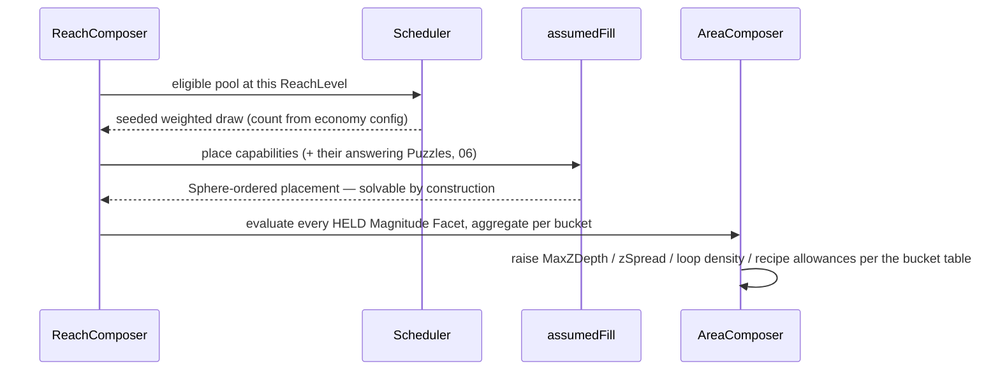

# 05 · Capabilities & Facets (the game-agnostic gadget contract)

> How CycleVania reacts to gadgets — shifting geometry, budgets, and placement odds around them —
> **without ever knowing what they do in gameplay terms**. Covers the hard corner cases: effects
> metered by a resource pool, progressive multi-tier upgrades, capabilities that only matter in
> combination, and one gadget with several unrelated uses. Puzzles get the identical first-class
> treatment in [06](./06-puzzles-locks-and-recipes.md).

## Why a static profile doesn't survive contact with real gadgets

An earlier design modeled a capability's effect as a static bundle of named number fields
(`verticalReach`, `gapSpan`, …). A plain number can't distinguish a flat double-jump from a
space-jump metered by a consumable, can't express "this only matters combined with a second
capability," and can't represent one item (a hammer that smashes walls, flips enemies, *and* hits
harder) whose effects should be independently placeable or gateable. The fix isn't a bigger bundle
of dials — it's changing *what kind of thing* an effect is: **capabilities carry Facets, and Facets
are evaluated, not stored.**

## The shapes

```ts
type CapabilityId = string;   // opaque — CycleVania never inspects it

interface CapabilityDef {
  id: CapabilityId;
  /** Granted directly by a Gadget pickup, or DERIVED from holding others (combos). */
  held: "granted" | { derivedFrom: CapabilityId[]; minLevels?: Partial<Record<CapabilityId, number>> };
  facets: Facet[];                          // zero or more
  powerWeight: (level: number) => number;   // 0..1 — drives the scheduler. Required: with static
                                            // dials gone there's nothing to estimate it from.
  guarantee?: { withinReachLevels: number };// optional pity window (below)
  category?: string;                        // host-only authoring label — stored, never interpreted
  revision?: number;                        // host bumps when callback behavior changes (02)
}

interface GadgetDef { id: string; grants: CapabilityId[]; }   // one pickup → 1..n capabilities

type Facet = MagnitudeFacet | TagFacet | ResourceFacet;

interface FacetContext {
  level: number;                            // how many times this capability has been granted so far
  resource?: { charge: number; capacity: number };  // present iff a ResourceFacet shares the id
  held: ReadonlySet<CapabilityId>;          // everything currently held — for combo-sensitive logic
}
```

### The three Facet shapes — and why exactly these three

Every way a capability can matter to generation reduces to one of three answer shapes: *how much*,
*can this specific thing happen here*, or *what pool does this draw from*.

```ts
interface MagnitudeFacet {
  kind: "magnitude";
  bucket: BuiltinBucket | `custom.${string}`;
  evaluate(ctx: FacetContext): number;      // in CYCLEVANIA's world units for that bucket
}

interface TagFacet {
  kind: "tag";
  tag: string;                              // the shared vocabulary (06, 08) — enables tagged content
  evaluate?(ctx: FacetContext): boolean;    // omit for "always active once held"
}

interface ResourceFacet {
  kind: "resource";
  poolId: string;                           // several capabilities may share one pool
  capacity(ctx: FacetContext): number;      // max charge at current level
  regenHint: "site" | "time" | "kill" | "none";  // CATEGORICAL placement hint, never a rate
}
```

- **Magnitude** feeds a named budget **bucket**. The closed built-in set L2 consumes directly:

  | Bucket | Feeds (L2 dial) |
  |---|---|
  | `traversal.zUp` | max upward ledge/shaft height the generator may demand; raises `zSpread`/`MaxZDepth` |
  | `traversal.zDown` | safe descent depth; enables one-way-drop loops |
  | `traversal.xyGap` | max horizontal gap recipes may span |
  | `traversal.permeate` | through-matter routes become placeable |
  | `traversal.perceive` | hidden/revealable content density allowance |
  | `traversal.timeHazard` | timed-hazard route allowance |
  | `traversal.weight` | weight/pressure recipe allowance |
  | `challenge.offense` / `challenge.defense` | encounter-budget hints echoed into Location/anchor metadata for the host |

  Anything else is `custom.*` — CycleVania aggregates and echoes it; the host's own systems read
  it. **The crucial boundary**: `evaluate()` returns values in *CycleVania's* units (voxel cells of
  clearance, world-grid gap widths) — never the game's units (meters, frames). The host performs
  the conversion inside the callback, once, at the boundary, because only the host knows its
  physics. This is how "the host knows the jump height, CycleVania doesn't" resolves without a
  `jumpHeight` field ever existing.

- **Tag** answers "can this specific environment feature exist/activate here" — boolean, never a
  magnitude. The `tag` string is matched against Socket signatures, revealable-geometry markers,
  puzzle `spatialRecipe` requirements, and anchor kinds — one shared vocabulary
  ([00](./00-goals-and-principles.md) principle 9), validated at registry load.

- **Resource** describes a consumable pool without simulating it. `regenHint` is categorical
  because generation only needs one decision: whether to scatter refill-site anchors (`"site"`).
  The actual regen simulation is 100% host runtime.

## Progressive upgrades — a level is just repeated grants

`level` = how many times a Gadget granting this `CapabilityId` has been placed and held. Facets
read `ctx.level`, so double-jump → triple-jump → space-jump is **one** `CapabilityDef` whose
magnitude grows with level. This is exactly what `count(cap, n)` already expresses on the Rule
side: "requires the capability at level ≥ n" — and assumed fill's counted-key induction
([03](./03-mission-graph.md)) already guarantees the *n*-th copy can't hide behind itself. Later
grant events of the same capability are themselves scheduled by the same eligibility curve,
evaluated at `powerWeight(nextLevel)` — a third tier of an already-strong capability lands later,
via the identical mechanism as a first pickup.

## Combos — derived held-state

```ts
{ id: "reveal-glyph-passage",
  held: { derivedFrom: ["translate-language", "rearrange-glyphs"] },
  facets: [{ kind: "tag", tag: "glyph-passage" }],
  powerWeight: () => 0.6 }
```

Nothing grants it directly; it becomes held automatically once all prerequisites are (at
`minLevels` if given). Use a derived capability when the combo deserves its own Facets or
scheduling weight; when a combo is *purely* gating, a plain `and(have(a), have(b))` Rule is simpler
and equivalent.

## Multi-use gadgets — two independent bundling axes

| Bundling | Shape | Use when |
|---|---|---|
| one Capability, one Facet | the simple case | a single effect |
| one Capability, many Facets | one pickup, one placement, all effects together | effects should never be separable |
| one Gadget, many Capabilities (`GadgetDef.grants`) | effects independently placeable/upgradeable/gateable | a boss requires *specifically* one of the effects |

Neither is "more correct" — a host authoring decision the data model doesn't force.

## The weighted, entropy-scaled scheduler

Shared machinery — the Puzzle pool ([06](./06-puzzles-locks-and-recipes.md)) runs the identical
mechanism against its own catalog, economy, and fork namespace, so the two pools never correlate.

```ts
function eligibility(reachLevel: number, powerWeight: number,
                     reachLevelsSinceEligible: number, guarantee?: { withinReachLevels: number }): number {
  if (guarantee && reachLevelsSinceEligible >= guarantee.withinReachLevels) return 1;  // pity: forced
  const midpoint = powerWeight * MAX_LEVEL_SHIFT;          // logistic curve shifted right by power
  return 1 / (1 + Math.exp(-(reachLevel - midpoint) / SOFTNESS));
}
```

- Sampled as a **probability** from the Reach's `gadget-schedule` fork — never a hard gate. A
  `powerWeight 0.9` capability has low-but-nonzero eligibility at level 0: rarely, legitimately,
  it shows up early. "Unlikely early, never impossible" is the design goal, verified
  distributionally in tests ([15](./15-verification-and-test-strategy.md)).
- The **virtual schedule** ([04](./04-worlds-reaches-and-pacing.md)) adds a large weight bonus for
  entries planned for this slot (plan = strong bias, not lock).
- The Reach's drawn **count** comes from `GadgetEconomyConfig`:

```ts
interface GadgetEconomyConfig { min: number; max: number; }   // progression items per Reach; default {1, 3}
```

adjusted by (stacking, in order): the chosen modifiers' `dials.gadgetEconomy` (player lever), then
`ReachRequest.gadgetEconomyOverride` (host lever). Pity-forced placements are exempt from `max`,
still count toward `min`. The final-Reach sweep ([04](./04-worlds-reaches-and-pacing.md))
force-places all remaining progression capabilities when `reachIndex === L − 1`.

- **The registry is the only source of capabilities.** Every capability that could ever be placed
  must exist in the `GadgetCatalog` at World-construction time — never invented mid-generation.
  Determinism requires the scheduler's starting pool to be fixed, seed-independent data.
- **Not every entry must be placed.** An unplaced capability never gates anything (a Lock can only
  reference a capability some Reach's own item list actually contains, directly or via
  `startHeld`), so unplaced entries never threaten solvability — they simply don't exist in that
  particular World.

## The world-shaping feedback loop

The mechanism behind "gaining verticality makes later areas more vertical":



Aggregation: for each bucket, sum `evaluate(ctx)` over every held capability's Magnitude Facets
(with the current level and a conservative resource assumption: `charge = capacity`). The
aggregates feed L2's dial derivation ([07](./07-spatial-skeleton.md)) and are echoed into Reach
meta so tooling can display *why* an area got vertical. A capability and the Puzzle answering it
are drawn independently enough that fill is always free to place the capability in an earlier
Sphere than the Puzzle needing it — never the reverse (the recipe in-scope rule,
[06](./06-puzzles-locks-and-recipes.md)).

## Placement of gadget Locations (exploration-reward)

Which *Location* a placed capability lands in is assumed fill's weighted choice, using the
`PlacementWeightConfig` defined in [03](./03-mission-graph.md): never the entry Region, at most one
progression item per Region (soft cap), depth/vault/behind-gate bias, sphere spreading. Net effect:
progression *and* environment feel organic and differ per seed, while remaining provably safe —
the weights only ever reorder the already-safe candidate set.

## Worked examples

| Variant | Facets on the capability | Where variance comes from |
|---|---|---|
| Simple double-jump | one `MagnitudeFacet(bucket: "traversal.zUp", evaluate: () => 2 * JUMP_UNIT)` | constant |
| Progressive double → triple → space-jump | same Facet, `evaluate: ctx => ctx.level * JUMP_UNIT` | `ctx.level` climbs per grant |
| Space-jump metered by a consumable | + `ResourceFacet(poolId, capacity: ctx => 3 + ctx.level, regenHint: "site")`; the magnitude folds `ctx.resource` into a conservative sustained value | two Facets, one capability |
| Progressive again as one gadget line | the same `CapabilityDef`, repeated grants | level accumulation |
| A pure collectathon key | `facets: []` — exists only to be counted by a `count(cap, N)` world puzzle | none; it's a key |
| A stat-only filler line | one magnitude into `custom.survivability`, `evaluate: ctx => ctx.level * 100` | host-read bucket |

CycleVania never sees "jump" anywhere — only buckets, levels, tags, and pools.

## Categorization

CycleVania's structural split is by Facet shape and bucket — never by gameplay flavor
("movement" / "combat" / "world"), because real gadgets routinely span all three at once (the
hammer example). `CapabilityDef.category` exists so hosts keep their own flavor grouping for
authoring/UI; CycleVania stores the string and never branches on it.
