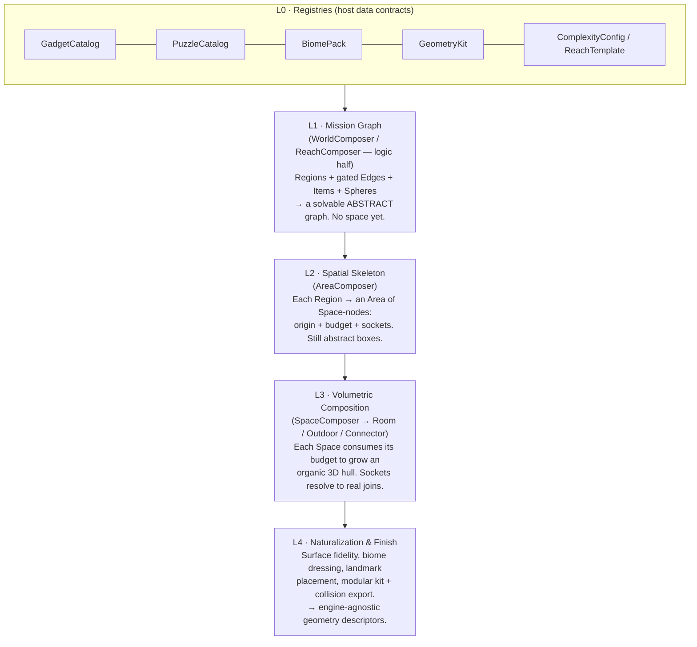
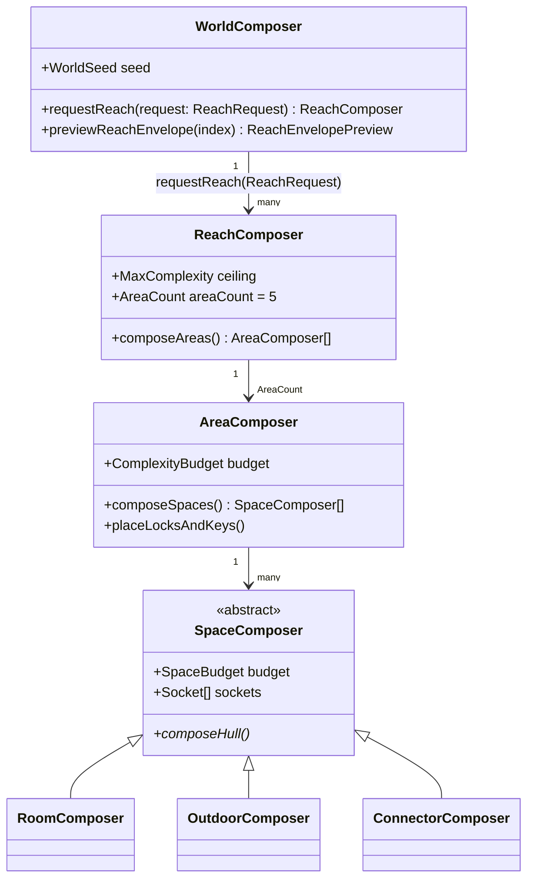
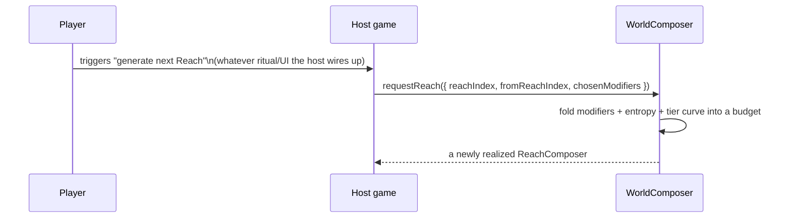

# 00 · Overview — a clean-sheet design

> **Status**: this `Docs/redesign/` folder is a from-scratch architecture proposal. Anything in
> the rest of `Docs/` or in existing source is *prior art only* — useful inspiration, not a
> constraint. Nothing here has been implemented yet; this is a plan.

## The one-sentence pitch

CycleVania turns **a seed + host-supplied game data** into a **provably-solvable, organically
shaped, engine-agnostic 3D metroidvania world** — by keeping *four* separate concerns in *four*
separate layers that never leak into each other: **logic** (is it solvable?), **skeleton** (how is
it wired in space?), **volume** (what does it organically look like?), and **finish**
(what do you actually render?).

## Why layers, and why these four

Solving progression-logic, spatial layout, and organic shape *simultaneously* is what produces
boxy, samey, "proc-genny" levels — the generator is fighting itself, trying to satisfy solvability
and geometry constraints in the same pass. Separating them means each layer gets the *right*
algorithm and cannot corrupt the guarantees of the layer below it:

**Solvability is fixed forever in L1 and never touched again.** Everything from L2 onward is free
to make choices *about space and beauty* without ever being able to break "can the player finish
the game" — that guarantee was already proven before a single coordinate existed.

## The composer hierarchy

Composers are the *only* stateful actors — everything else (registries, rules, SDFs) is pure data
or pure functions, which is what keeps the whole pipeline deterministic and testable in isolation.

See [02 · Composers & complexity](./02-composers-and-complexity.md) for full responsibilities.

## Design principles (non-negotiable across every layer)

1. **Game-agnostic by contract, not by accident.** CycleVania never hardcodes what a Gadget *does*
   in gameplay terms, what a puzzle *is*, or what a biome *looks* like — it only ever consumes
   host-supplied data through named contracts (registries). See
   [03 · Gadgets & Capabilities](./03-locks-keys-and-gadgets.md) and
   [07 · Puzzles & challenges](./07-puzzles-and-challenges.md).
2. **Solvable by construction, never by retry.** Items are placed such that the world is
   guaranteed solvable the moment placement finishes — there is no "generate, then check, then
   regenerate on failure" loop anywhere in the design.
3. **Deterministic end-to-end.** One `WorldSeed` → byte-identical output, forever, on every
   platform. See [05 · Determinism & extensibility](./05-determinism-and-extensibility.md).
4. **Organic by construction, not by decoration.** Entropy/weighting is baked into the choice
   algorithms themselves (budget curves, gadget scheduling, hull selection) — "naturalization" is
   not a coat of paint applied at the end, it's a property of every layer.
5. **Virtual space is not world space.** World/Reach are pure data containers that decide *what*
   should exist; they never carry a literal 3D transform themselves. Only Areas/Spaces (L2/L3)
   have real coordinates. See [01 · Mission graph](./01-mission-graph.md).
6. **Lazy by default — nothing is generated until requested.** A Reach doesn't exist, even
   abstractly, until an explicit `ReachRequest` asks for it. `WorldComposer` never eagerly walks
   the whole seed → Reach 0 → Reach 1 → … → Reach *N* chain up front — it only ever realizes
   exactly what's been asked for, when it's asked for. See
   [02 · Composers & complexity](./02-composers-and-complexity.md).

## On-demand generation, in one picture

Reaches aren't pre-baked — each one is generated the moment a host-defined trigger asks for the
*next* one, optionally carrying player-chosen risk/reward **Reach modifiers** the host defines and
names however it likes:

CycleVania has no opinion on *what* triggers a request (a shrine, a menu, an NPC, a resource
sacrifice — entirely the host's fiction) or what the modifiers are called in-game — it only ever
sees the `ReachRequest` shape. Full mechanics (the `ReachRequest`/modifier contract, and why
on-demand generation doesn't cost determinism or break lookahead) are in
[02 · Composers & complexity](./02-composers-and-complexity.md), whose reasoning is grounded in the
"infinite terrain chunk" analogy spelled out in
[05 · Determinism & extensibility](./05-determinism-and-extensibility.md).

## Reading order

- [01 · Mission graph](./01-mission-graph.md) — Spheres, Regions, Locations, Items, assumed fill.
- [02 · Composers & complexity](./02-composers-and-complexity.md) — the composer hierarchy, budgets,
  and the entropy-weighted `ReachIndex` formula with lookahead/lookbehind.
- [03 · Gadgets & Capabilities](./03-locks-keys-and-gadgets.md) — the game-agnostic Capability/Facet
  contract and its weighted placement scheduler.
- [04 · Spatial composition & sockets](./04-spatial-composition-and-sockets.md) — Sockets (connectivity
  + WFC + content anchors), organic volumetric hulls, biomes, landmarks.
- [05 · Determinism & extensibility](./05-determinism-and-extensibility.md) — the RNG rules and the
  host integration surface.
- [06 · Dial audit](./06-dial-audit.md) — every host-facing knob across the whole design, in one
  table, plus a handful of proposed additions worth considering before implementation.
- [07 · Puzzles & challenges](./07-puzzles-and-challenges.md) — Puzzles and Locks as their own
  first-class, equally-important pool: scope, outcomes, world-spanning collectathons, and design
  research grounding the defaults.
- [08 · Case study — Metroid Prime](./08-metroid-prime-case-study.md) — a full reconstruction
  exercise proving the schema holds a real, ~100-item, ~200-room 3D metroidvania at scale, plus a
  concrete test-dataset proposal.
