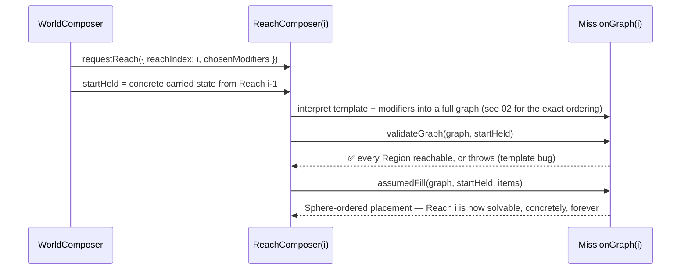
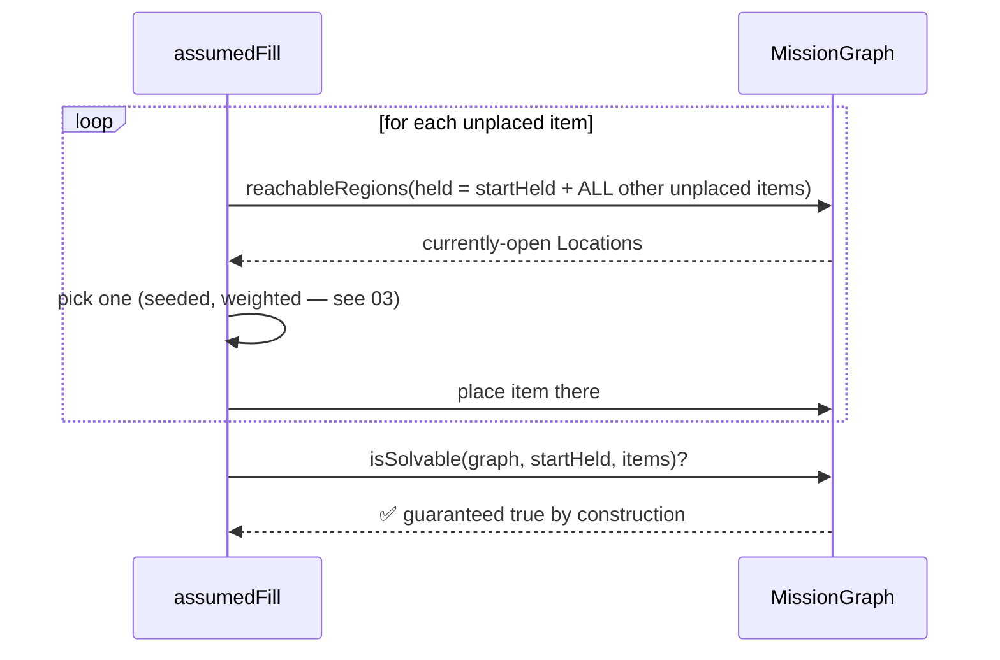
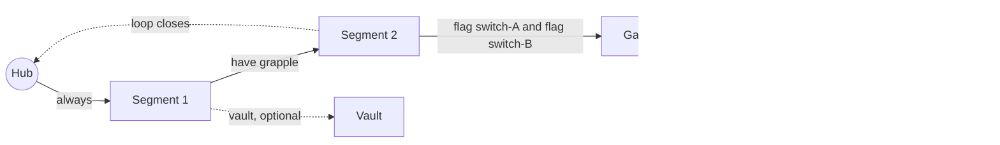

# 01 · Mission graph (L1 — logic, no space yet)

> Adapts the Archipelago randomizer's formal model — **Regions**, **Locations**, **Items**,
> **Spheres** — into a self-contained logic layer that produces a *provably solvable* abstract
> graph before a single Space exists. `WorldComposer` and `ReachComposer` live entirely here.

## Vocabulary

| Term | Meaning |
|---|---|
| **Region** | A node in the mission graph; each one maps 1:1 onto exactly one Area in L2. A Reach's *total* Region count is itself a ranged, weighted choice — see `AreaCountConfig` in [02](./02-composers-and-complexity.md) — not a fixed number; "1:1" describes the mapping, not the count. |
| **Location** | A placeable slot inside a Region (an item pedestal, a switch, a chest). |
| **Item** | Something placed at a Location. Classed `progression \| useful \| filler \| bonus`. |
| **Capability** | An opaque, host-defined id (e.g. `"wall-climb"`) a progression Item grants. CycleVania is told exactly what it *affects*, *how much*, and *under what conditions* — via Facets, see [03](./03-locks-keys-and-gadgets.md) — it just never knows *how* it's performed in gameplay, or why it makes fictional sense. |
| **Rule** | Gates an edge or a Location: `have(cap) \| count(cap,n) \| flag(name) \| and \| or \| not \| always`. |
| **Sphere** | The solvability ladder: Sphere 0 = reachable with nothing; Sphere *n* = reachable once every capability from Spheres `< n` is held. |
| **Flag** | A boolean world-state fact set by solving something (a switch, a puzzle, a boss) — first-class in the graph, not a side note (needed for multi-room/compound locks, see [03](./03-locks-keys-and-gadgets.md)). |

## The graph itself

```ts
interface Region { id: string; }
interface Edge { from: string; to: string; rule: Rule; oneWay?: boolean; }
interface MissionGraph {
  regions: Region[];
  edges: Edge[];
  locations: Map<string, string>;   // locationId -> regionId
  start: string;
}
```

`reachableRegions(graph, held)` is a fixed-point BFS: follow an edge only when its `rule` currently
passes against a `Held` (capabilities + flags + counted keys/levels). `computeSpheres` re-runs this
sphere-by-sphere, collecting newly-reachable Items as it goes. `isSolvable(graph, held0, items)` is
the single zero-softlock guarantee: *every* progression capability introduced by `items` is
collectible **and** every non-bonus Location is reachable, once fully equipped — starting from
`held0`, not from empty. That starting parameter is the crux of the next section.

## Solvability is scoped to exactly one Reach at a time

This needs to be explicit, because "generated on demand" and "provably solvable" can look like they
pull in opposite directions until you see where the boundary actually sits.

**One `requestReach` call materializes one complete `MissionGraph` — every Region and Location for
*that* Reach, all at once.** Nothing about a Reach is partially generated; `ReachComposer.
composeAreas()` interprets the whole template into a whole graph in a single pass. So within the
scope of *this* function call, `validateGraph`/`assumedFill` are operating on a graph that is
entirely, concretely in memory — there is no ambiguity about "not all Regions exist yet" *inside*
one Reach.

The lazy/on-demand part ([02](./02-composers-and-complexity.md)) is about the relationship
*between* Reaches, not within one: Reach `i + 1` doesn't exist yet, and Reach `i`'s solvability
proof never needs it to. The corrected signatures make the scope explicit in the types themselves:

```ts
function validateGraph(graph: MissionGraph, startHeld: Held): void;   // throws on a stranded Region
function assumedFill(graph: MissionGraph, startHeld: Held, items: Item[]): Placement;
```

`startHeld` is **`Held`, not `Rule`** — a concrete, already-fixed snapshot of every capability/flag
carried forward from Reaches `0..i-1`, which are themselves already fully realized by the time
Reach `i` is requested (whatever host-defined trigger issues a `ReachRequest` necessarily lives
*inside* an already-realized Reach). `validateGraph`'s "every Region reachable when fully equipped"
claim is therefore always: *reachable using `startHeld` plus everything this Reach's own
`assumedFill` will place* — a claim entirely about this one Reach's graph, never about Reach `i+1`
or beyond, because nothing in `i+1` can be a precondition for finishing `i`.



This is what makes the induction work without ever materializing more than one Reach's graph:
Reach 0 is solvable standalone (`startHeld = ∅`); Reach `i` is solvable given Reach `i-1`'s *already
concrete* `startHeld`; therefore every realized prefix of the World is solvable, one Reach at a
time, with no step ever depending on something that doesn't exist yet. There is deliberately **no
whole-World graph and no whole-World solvability proof** — that concept doesn't need to exist for
the guarantee to hold.

### This does not mean a Reach places the whole game

Nothing above requires — or even suggests — that Reach 0 tries to place every Capability the
registry contains, and the identical statement holds for Puzzles ([07](./07-puzzles-and-challenges.md)):
by default neither pool is front-loaded. A World has its own `WorldLengthPolicy`
([02](./02-composers-and-complexity.md)), and **two** independently-paced, fixed content pools —
say, 24 Capabilities *and, just as importantly, on equal footing,* 64 Puzzle instances
([07](./07-puzzles-and-challenges.md)) — are each expected to *stretch across however many Reaches
that policy produces*. `assumedFill`'s "every other unplaced item" in the next section means
unplaced **within this Reach**, not unplaced in the whole registry. Two ends of the same mechanism:

- A World configured with, say, `WorldLengthPolicy = { min: 4, max: 6 }` spreads its 24 Capabilities
  *and* its 64 Puzzles across whichever Reach count gets drawn, each via its own virtual schedule
  described in [02](./02-composers-and-complexity.md)/[07](./07-puzzles-and-challenges.md) — most of
  them are *not* placed in Reach 0 at all, and that's the intended shape, not a limitation this
  section is working around.
- A World configured with `WorldLengthPolicy = { min: 1, max: 1 }` collapses to exactly one Reach,
  so all 24 Capabilities *and* all 64 Puzzles *would* be placed immediately, in that single Reach —
  no lookahead needed, because there's nothing left to look ahead *to*.

Both are the same `validateGraph`/`assumedFill` mechanism above, just fed different-sized `items`
list for Reach 0 — the per-Reach solvability proof never changes shape; only how much of the
registry's total content this particular Reach is responsible for does.

## Assumed fill — placing items so solvability is constructed, not checked

This is the core trick that avoids "generate → validate → regenerate on failure" loops entirely,
run once per Reach against that Reach's own graph and its `startHeld`:

1. To place the **next** item, assume the party already holds **every other unplaced** item (from
   this Reach) *plus* everything in `startHeld`.
2. Find every currently-empty, currently-reachable Location under that assumption.
3. Drop the item in one of them (weighted/seeded choice — see [03](./03-locks-keys-and-gadgets.md)
   for *how* that weighting works, including the pity/guarantee mechanism for progression items).
4. Repeat until every item is placed.

Because each item is only ever gated behind items placed **after** it (or already in `startHeld`),
this inductively produces a valid Sphere ordering — a softlock is structurally impossible, not just
statistically unlikely. Counted keys/levels (`count(cap, N)`) fall out "for free": placing the
*n*-th copy of a counted item only assumes `n − 1` are already held, so the last copy can never
accidentally hide behind itself — and this is the same mechanism a progressive-upgrade Capability's
level uses (see [03](./03-locks-keys-and-gadgets.md)).



**Construction-time precondition**: `validateGraph(graph, startHeld)` must confirm every Region in
*this* graph is reachable *when fully equipped with startHeld + this Reach's own items*, before
fill even runs. If a template can produce a stranded Region, that's a template bug — it fails
loudly at generation time, never silently at play time. Because both arguments are fully concrete
by the time this runs (see the pipeline ordering in
[02 · Composers & complexity](./02-composers-and-complexity.md)), this check never has an "not all
Regions exist yet" problem to begin with.

## `ReachTemplate` — the macro-shape, as data

A `ReachTemplate` never mentions concrete Capabilities — only structure:

```ts
interface ReachTemplate {
  criticalPath: string[];                 // ordered node roles along the spine
  nodes: Record<string, { role: NodeRole; slots: { min: number; max: number } }>;
  branches: BranchSpec[];                 // optional vaults hung off the spine
  gating: { lockFraction: number; compoundChance: number };
  loops: { guaranteeAtLeastOne: boolean };
}
type NodeRole = "hub" | "segment" | "gate" | "vault" | "capstone" | "terminal";
```

- `hub` — the Reach's entry/save point; over-provisions always-reachable bootstrap Locations so the
  player is never stranded with nothing to do.
- `segment` — ordinary critical-path progress.
- `gate` — its *entrance* edge is always locked (a deliberate checkpoint).
- `vault` — an optional branch off the spine; loot-flavored, not required to finish.
- `capstone` — the Reach's set-piece. **The last Area of every Reach is always a `capstone`.**
- `terminal` — the hand-off to the next Reach (or the World's end).

`ReachComposer.composeAreas()` interprets a template **plus that Reach's chosen modifiers** into a
concrete `MissionGraph` (`generateReach`), gates `lockFraction` of critical-path edges, hangs
`branches` with their own entrance rule, closes at least one loop if `loops.guaranteeAtLeastOne`,
then runs `validateGraph` + `assumedFill` and **throws** on failure — a malformed template is a
bug, not runtime input. The exact order in which modifiers get folded in before this happens is
spelled out in [02](./02-composers-and-complexity.md).

## The boss Area

Per the brief: **the final Area of a Reach always contains a `BossChamber` (indoor) or
`BossArena` (outdoor)** — this is simply the `capstone` node's Area, and whether it becomes a
Chamber or an Arena is decided by whichever `SpaceComposer` subclass L3 picks for it (see
[04](./04-spatial-composition-and-sockets.md)), typically biased by the Reach's biome.

## Example mission graph (default template shape)



## What World/Reach explicitly do **not** do

Per the brief: **Worlds and Reaches never carry a literal 3D transform.** They are pure data
containers that decide *what should exist* (how many Areas, which template, which capabilities);
the first time anything gets a coordinate is when `AreaComposer` places a Space in L2. A World's
"virtual, infinite, shrink/expand-to-fit" bounds are therefore just the union of the *realized*
Area bounds so far — never a pre-allocated volume.

This dovetails with **on-demand generation**: `WorldComposer` doesn't walk `reachIndex` 0..N on its
own initiative. Every Reach past the first is produced by an explicit, externally-triggered
`ReachRequest` — see [02 · Composers & complexity](./02-composers-and-complexity.md) for the full
contract. CycleVania only ever sees that request shape; what actually triggers one in-fiction and
what its modifiers are called is entirely up to the host.

## What this guarantee does *not* promise

Worth stating plainly, since it's easy to over-read "provably solvable": CycleVania guarantees
every non-bonus Location is *reachable* — never that it's *survivable*. Whether a given Reach's
encounters are appropriately tuned for whatever power level a party has at that point is entirely a
host concern (character stats, gear, levels — concepts CycleVania has no model of at all). A host
is completely free to build a game where a logically-reachable Reach is, in practice, a wall a
player needs to go get stronger elsewhere before attempting — CycleVania's contract ends at
"reachable," on purpose, so it never needs an opinion on anything resembling a player's power curve.
