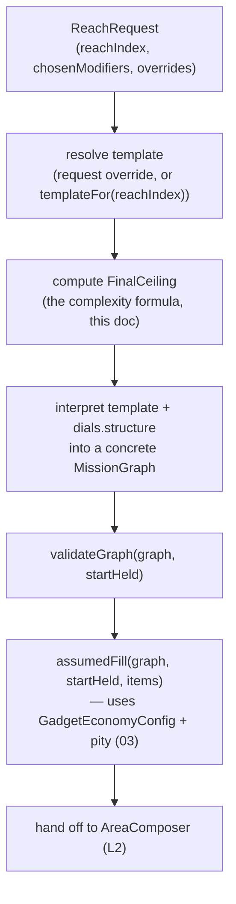
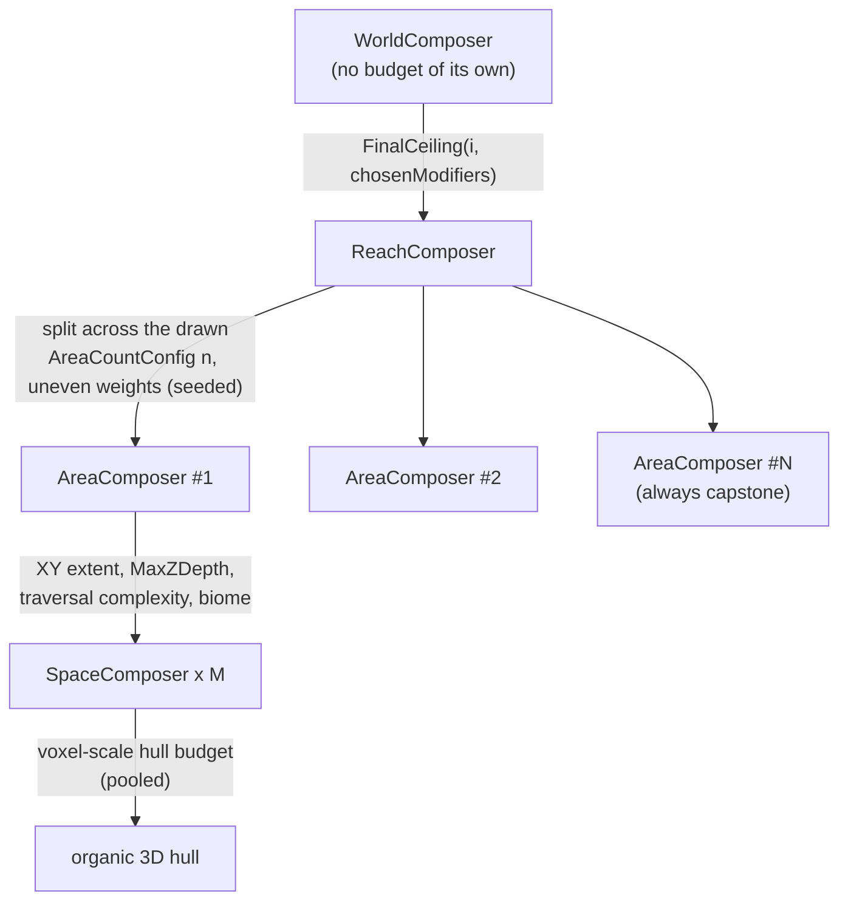

# 02 · Composers & complexity (L1→L2 — budgets, entropy & on-demand generation)

> The composer hierarchy, how a complexity **budget** cascades and gets spent, the `ReachIndex`
> entropy formula, and — new in this revision — how Reaches are **requested on demand** (never
> pre-scheduled) and how player-chosen **Reach modifiers** fold into the same budget math. Every
> concept here is CycleVania's own generic vocabulary; a host names and themes these however it
> wants (see the "never assumes gameplay" checklist in [05](./05-determinism-and-extensibility.md)).

## Responsibilities, top to bottom

| Composer | Owns | Produces |
|---|---|---|
| `WorldComposer` | `WorldSeed`; the realized Reaches so far | Reaches, strictly on request (see below) |
| `ReachComposer` | `MaxComplexity` ceiling; `AreaCountConfig` (default `{min:5, max:5}`) | A `MissionGraph` (L1) laid out into however many Areas get drawn — see below |
| `AreaComposer` | Its slice of the Reach's complexity budget | `SpaceComposer` instances + Lock/Key placement ([03](./03-locks-keys-and-gadgets.md)) |
| `SpaceComposer` *(abstract)* | Its slice of the Area's budget; its `Socket[]` | An organic 3D hull ([04](./04-spatial-composition-and-sockets.md)) |

## How many Areas should a Reach have? (`AreaCountConfig`)

A Reach's Area count is a **ranged, weighted choice**, not a fixed constant — this is the same
"min/max range + optional weighting curve, uniform by default" pattern used everywhere else in
these docs (`ReachModifierPolicy`'s pool, `GadgetEconomyConfig`'s per-Reach item count, and
`WorldLengthPolicy` below), applied here to Region/Area count:

```ts
interface AreaCountConfig {
  min: number;
  max: number;
  /** Relative weight for choosing `n` Areas, n in [min, max]. Omitted = uniform (every candidate
   *  equally likely). A host is free to fold in reachIndex, the chosen Reach modifiers, or the
   *  Reach's own FinalCeiling — entirely the host's call what the curve considers. */
  weights?: (n: number, ctx: { reachIndex: number; chosenModifiers: ReachModifierId[]; finalCeiling: number }) => number;
}
```

`n` is drawn once per Reach, seeded, the moment `FinalCeiling(i, chosenModifiers)` is known (so a
`weights` function can legitimately react to it). **CycleVania's own shipped default is
`{ min: 5, max: 5 }`** — a degenerate range that always yields exactly 5, calibrated against the
scale note in [06 · Dial audit](./06-dial-audit.md) — fully overridable by a host to any range and
curve it wants; nothing about the algorithm assumes a fixed count anywhere downstream.

## Reaches are requested, not scheduled

`WorldComposer` never iterates `reachIndex = 0..N` on its own initiative. Every Reach beyond the
first exists only because something explicitly asked for it:

```ts
interface ReachRequest {
  reachIndex: number;              // the slot being realized; WorldComposer validates it's the next legal one
  fromReachIndex?: number;         // the already-REALIZED Reach this request originated from (undefined only for reachIndex 0)
  chosenModifiers: ReachModifierId[];   // player-chosen modifiers, validated against that depth's policy
  template?: ReachTemplate;        // optional override of the World's default templateFor(reachIndex)
  gadgetEconomyOverride?: Partial<GadgetEconomyConfig>;  // see "Progression-item frequency" in 03 —
                                    // the host may retune min/max progression items *at request time*,
                                    // independent of (and stacking with) any chosen modifier's own delta
  puzzleEconomyOverride?: Partial<PuzzleEconomyConfig>;  // the identical override, for the Puzzle
                                    // pool instead of the Gadget pool — see 07
}

WorldComposer.requestReach(request: ReachRequest): ReachComposer
```

CycleVania has **no opinion on what triggers a `ReachRequest`** — a shrine, a menu screen, an NPC
conversation, a resource sacrifice, anything else a host wants — and no opinion on what the chosen
modifiers are called or how they're presented. It enforces exactly one structural rule:
`fromReachIndex`, when present, must refer to an already-realized Reach. That's what lets the same
mechanism support either a strict linear chain (each trigger leads to exactly the next Reach) or a
branching structure (several unlocked trigger points, each capable of requesting a different
still-unrealized slot) purely as a *host* decision — CycleVania is agnostic to which shape a given
game uses.

## Reach modifiers — player-chosen risk/reward dials

A **Reach modifier** is a data-driven, opt-in (then eventually mandatory) choice the player makes
*before* a Reach is generated, and CycleVania treats it as a fourth input into the budget math it
already has — not a separate system:

```ts
type ReachModifierId = string;   // opaque — CycleVania never inspects its meaning, only its dials

interface ReachModifierDef {
  id: ReachModifierId;
  riskWeight: number;      // 0..1 — how much this can hurt (bigger/harsher budgets, denser hazards…)
  rewardWeight: number;    // 0..1 — how much this can pay off (loot tier, bonus gadgets/locations…)
  minDepth: number;        // first depth at which this modifier enters the pool at all
  dials: DialPatch;        // what it actually changes — see below
  excludesTags?: string[]; // simple mutual-exclusion support
  tags?: string[];
}

/** Deltas, never overwrites — the same "patch a budget" shape everywhere in CycleVania. */
type DialPatch = {
  complexity?: { additive?: Partial<ComplexityConfig>; multiplier?: Partial<ComplexityConfig> };
  gadgetEconomy?: Partial<{ min: number; max: number }>;
  puzzleEconomy?: Partial<{ min: number; max: number }>;   // identical shape, the Puzzle pool (07)
  reward?: Partial<{ lootTierBonus: number; bonusLocations: number }>;
  hazard?: Partial<{ densityMul: number }>;
  /** Probabilistic nudges to TEMPLATE INTERPRETATION itself (not just magnitudes) — e.g. raising
   *  the odds a `vault` branch gets hung, or that an extra loop closes. Seeded, never guaranteed;
   *  applied while the template is being turned into a concrete graph, strictly before
   *  `validateGraph` runs (see "The Reach-generation pipeline, in order" below). */
  structure?: Partial<{ extraBranchChance: number; extraLoopChance: number }>;
  /** Same escape-hatch pattern as `CustomAffordanceHandler` (03) — host-named dials CycleVania
   *  doesn't ship a meaning for, but still weighs generically. */
  custom?: Record<string, number>;
};

interface ReachModifierPolicy {
  /** Grows with depth — filters the full catalog by `minDepth <= depth`. */
  poolAt(depth: number): ReachModifierDef[];
  /** How many modifiers must/may be chosen at this depth. */
  requiredRange(depth: number): { min: number; max: number };
}
```

### The optional → mandatory ramp

`ReachModifierPolicy.requiredRange` is entirely host-configured data — an illustrative shape a host
might choose:

| Depth | pool size (illustrative) | `requiredRange.min` | flavor |
|---|---|---|---|
| 0–2 | 3 | 0 | optional, low risk / low reward |
| 3–7 | 7 | 0 | optional, wider variety |
| 8–14 | 12 | 1 | **at least one** mandatory |
| 15+ | 18+ | 2 | **at least two** mandatory, high-risk modifiers unlocked |

This produces a "somewhat linear/curved ramp in difficulty over time" driven by an **informed
player choice inside an algorithmic envelope**, not by RNG alone — it sits directly alongside the
entropy-driven ramp below; both exist at once.

## The complexity formula, now with a fourth term

The first three terms are unchanged from the previous revision of this doc:

```ts
ReachLevel(i)        = Math.floor(i / TIER_SIZE);
ExpectedCeiling(i)   = BaseCeiling * (1 + K_MUL * ReachLevel(i)) + K_ADD * i;
const jitter         = triangular(rng.fork(`reach-entropy:${i}`), -JITTER_FRAC, +JITTER_FRAC) * ExpectedCeiling(i);
ActualCeiling(i)     = clamp(lerp(ExpectedCeiling(i), RealizedCeiling(i - 1), LOOKBEHIND_PULL) + jitter, MIN_CEILING, HARD_MAX);
```

Reach modifiers layer a **fourth, player-chosen** term on top — additive and multiplicative deltas
from every chosen modifier's `dials.complexity`, combined and clamped against a second, higher
safety ceiling that holds regardless of how many modifiers get stacked:

```ts
const additive    = sumAll(chosenModifiers.map(m => m.dials.complexity?.additive));
const multiplier  = chosenModifiers.reduce((acc, m) => acc * (1 + sumAll([m.dials.complexity?.multiplier])), 1);

FinalCeiling(i, chosenModifiers) = clamp(
  ActualCeiling(i) * multiplier + additive,
  MIN_CEILING, ABSOLUTE_HARD_MAX,   // independent of how many modifiers got stacked
);
```

Reach modifiers don't *replace* organic algorithmic variance — they add an explicit, player-visible
lever on top of it. A player who picks none (while still legal) still gets the ambient tier-curve +
entropy ramp from before; picking modifiers is how they consciously push past it.

**Determinism note**: the RNG fork label for a Reach's generation must include the chosen modifier
set, not just its index — `rng.fork(\`reach${i}:mods[${sortedModifierIds.join(",")}]\`)`. Identical
seed + identical modifier choices reproduce byte-identical output; a different choice legitimately
forks a different (still fully deterministic) substream. See
[05](./05-determinism-and-extensibility.md) for the full reproducibility argument.

## The Reach-generation pipeline, in order

Answering "how do we validate a graph when not everything exists yet" (see
[01](./01-mission-graph.md)) requires pinning down exactly *when* each step below runs — modifiers
must be fully folded in, including any `dials.structure` nudge, before `validateGraph` ever sees the
graph, or the validated graph wouldn't be the one that actually gets played:



Steps A–D are where a Reach's *shape* gets decided (structure, budget); E–F are where its
*solvability* gets constructed and proven, per Reach, exactly as described in
[01](./01-mission-graph.md). Nothing past step D can retroactively change what step E validates —
this ordering is itself part of the determinism contract, not just a convenience.

## Lookahead, reworked: which layer it lives on, and how it stays lazy-safe

This is the piece the brief flags as crucial, so it earns a careful answer.

**It lives on `WorldComposer` — one level *above* `ReachComposer`.** That placement isn't
arbitrary: a preview must be answerable for a Reach slot that has **no `ReachComposer` instance
yet** (there is nothing further down the hierarchy to ask). Only the World, which owns the seed and
the realized history, can answer "what would slot *i* look like?" before slot *i* exists.

```ts
interface ReachEnvelopePreview {
  meanNoModifiers: number;
  rangeWithMinModifiers: { low: number; high: number };
  rangeWithMaxModifiers: { low: number; high: number };
  modifierPoolSize: number;
  requiredRange: { min: number; max: number };
  /** From the virtual schedule (see "How many Reaches should a World have?" below) — which
   *  Capabilities are currently planned to land in this slot. Only meaningful when
   *  `WorldLengthPolicy` is bounded; omitted for an open-ended World. */
  plannedCapabilities?: CapabilityId[];
  /** True when `index === L - 1` under the drawn `WorldLengthPolicy` — i.e. this slot is
   *  currently the World's declared final Reach, and will perform the mandatory final sweep. */
  isDeclaredFinalReach: boolean;
}
WorldComposer.previewReachEnvelope(index: number): ReachEnvelopePreview
```

This **supersedes** the simpler `previewReachBudget(index): BudgetEstimate` sketch from the
previous revision — same spirit, richer shape, because the host now needs to show the player a
genuine risk/reward preview (a "here's roughly what committing here looks like") *before* they pick
modifiers, not just a single expected number.

Two properties are load-bearing and must never be violated:

1. **Pure and read-only.** `previewReachEnvelope` is a function only of `(WorldSeed, index, the
   already-REALIZED facts about earlier Reaches, the static modifier catalog/policy data)`. It
   **never draws from the entropy RNG stream** — calling it costs nothing and perturbs nothing,
   including never consuming the `reach-entropy:${i}` fork before Reach *i* is actually requested.
2. **Cheap regardless of how far `index` is from what's realized.** Because it only reads
   already-fixed facts (never simulates unrealized intermediate Reaches), evaluating the preview
   for slot 40 costs the same as slot 4. This is the exact property infinite-terrain generation
   relies on — see [05](./05-determinism-and-extensibility.md) for the direct analogy and why it's
   *not* a coincidence that the two problems share a solution shape.

`ReachComposer(i)` still calls `previewReachEnvelope(i + 1)` internally to soften its own jitter
pull toward its neighbor's expected range (unchanged from the previous revision) — the same query
now also powers whatever selection UI the host builds around `requestReach`. One function, two
consumers: the algorithm's own self-smoothing, and the host's player-facing preview.

## How many Reaches should a World have? (`WorldLengthPolicy`, and the virtual schedule)

Everything above assumes Reaches keep coming; this section is about *whether* they do, and how
content spreads across however many there end up being — including the two ends of the spectrum a
host might configure: a World with a genuine min/max Reach-count range that needs to pace a fixed
pool of Capabilities across it, and a World that is deliberately just one single, massive Reach.

### `WorldLengthPolicy` — the same ranged pattern, one level up

```ts
interface WorldLengthPolicy {
  min: number;
  max: number;   // required for the virtual-schedule/final-sweep mechanism below. Omit only for a
                 // genuinely open-ended World — see "Unbounded Worlds" below for what's lost.
  weights?: (n: number) => number;   // defaults to uniform, same pattern as AreaCountConfig
}
```

`L` — the World's actual total Reach count — is drawn **once**, deterministically, from
`rng.fork("world-length")`, keyed on `WorldSeed` alone, the moment a World is configured (before
Reach 0 is even requested). This doesn't contradict [00](./00-overview.md)'s "a World is virtually
infinite, spatially" claim — that claim is about *spatial* bounds (which only ever grow to cover
what's actually been realized); `L` is a small, purely *logical* commitment, the exact same kind of
one-time draw `AreaCountConfig` already makes per Reach, just one level higher in the hierarchy.
Setting `min = max = 1` is a legitimate, fully-supported value — not a special case, just the
degenerate end of the same range, and it's exactly the "one single massive Reach" configuration.

### The virtual schedule — pacing a fixed content pool across `L` Reaches

Once `L` is known, `WorldComposer` can answer a question no single `ReachComposer` could: "of the
entries in a given schedulable pool, roughly which Reach should each one land in, so a fixed pool
paces sensibly across a fixed length?" This is computed **once, cheaply, purely** — not simulated
per Reach — and it is **generic over which pool it's asked about**: Capabilities
([03](./03-locks-keys-and-gadgets.md)) and Puzzles ([07](./07-puzzles-and-challenges.md)) each get
their own independent run of the identical function, against their own catalog and their own RNG
fork namespace, so the two pools never share or compete for entropy:

```ts
function computeVirtualSchedule<T extends { id: string; powerWeight: (level: number) => number }>(
  seed: WorldSeed, L: number, pool: T[], forkNamespace: string,
): Map<string, number /* planned reachIndex, 0..L-1 */>
```

It runs the *same* eligibility logic as the real per-Reach scheduler
([03](./03-locks-keys-and-gadgets.md), [07](./07-puzzles-and-challenges.md)), just evaluated across
all `L` slots at once, from `rng.fork(forkNamespace)` (e.g. `"virtual-schedule:gadgets"` vs.
`"virtual-schedule:puzzles"`) — streams entirely separate from real per-Reach placement, so
computing or consulting either plan never perturbs actual generation, exactly the same read-only
guarantee `previewReachEnvelope` already gives. This is cheap specifically *because* `L` is small
and bounded — unlike Hull/mesh generation, pre-planning which Capability or Puzzle goes roughly
where costs nothing close to real geometry work, so there's no tension with staying lazy about the
*expensive* stuff.

When Reach `i` is actually requested, its own `assumedFill` reads each pool's `virtualSchedule` as a
**strong bias, not a hard lock** — entries planned for slot `i` (Capabilities and Puzzles alike) get
a large weight bonus in that Reach's own (separately-seeded) eligibility roll, so the *plan* is very
likely to hold, but ordinary entropy can still shift something by a Reach or two, exactly like every
other "organic, not strictly linear" mechanism in this design. See
[03](./03-locks-keys-and-gadgets.md)/[07](./07-puzzles-and-challenges.md) for how this composes with
each pool's own `guarantee.withinReachLevels` pity window — they're complementary, not competing,
tools.

### The final-Reach sweep — the hard backstop, and why it makes the single-Reach case fall out for free

When `reachIndex === L - 1`, that Reach **is**, by construction, the World's declared final one.
`assumedFill` for that Reach performs a mandatory sweep, run independently for **each** pool: every
still-unplaced `required`-class Puzzle ([07](./07-puzzles-and-challenges.md)) and every still-
unplaced `progression`-class Capability the registry contains gets force-placed there (exempt from
that pool's own economy `.max`, same exemption rule as ordinary pity — see
[03](./03-locks-keys-and-gadgets.md)/[07](./07-puzzles-and-challenges.md)), regardless of how much
either virtual schedule's plan has already drifted by that point. This is what makes both of the
motivating examples work from **one mechanism**, not two special cases:

- `WorldLengthPolicy = { min: 4, max: 6 }`: a 24-Capability pool *and* a 64-Puzzle pool each pace
  across whichever `L in [4,6]` gets drawn, biased by their own virtual schedule, with the final
  Reach guaranteeing anything that drifted too late in either pool still lands before the World's
  declared end.
- `WorldLengthPolicy = { min: 1, max: 1 }`: `L = 1`, so Reach 0 is trivially *both* the first and
  the final Reach — both sweeps fire immediately, and all 24 Capabilities *and* all 64 Puzzles land
  in that one Reach, with no lookahead, no virtual schedule drift to worry about, and no further
  Reach generation ever required. Exactly the "one shot, fully deterministic, pre-generated World"
  case, produced by the same rule that paces a 6-Reach World, just evaluated at its smallest
  possible `L`.

### Unbounded Worlds

If a host genuinely wants no ceiling at all (`WorldLengthPolicy` omitted, or `max` absent), there is
no `L` to compute a virtual schedule against and no final Reach to sweep with. The *only* remaining
cross-Reach guarantee tool is each pool's own per-entry `guarantee.withinReachLevels` pity window
([03](./03-locks-keys-and-gadgets.md), [07](./07-puzzles-and-challenges.md)) — every Capability or
Puzzle that wants a hard promise has to carry its own bounded window, since CycleVania has nothing
global to backstop against in a World with no declared end. This is a genuine trade-off a host
makes by choosing to stay unbounded, not an oversight.

## Worked example, extended with Reach modifiers

| `i` | `ReachLevel` | `ExpectedCeiling` | entropy jitter | `ActualCeiling` | Modifiers chosen | `FinalCeiling` |
|---|---|---|---|---|---|---|
| 0 | 0 | 100 | +4 | 104 | none (optional) | 104 |
| 3 | 1 | 145 | −6 | 139 | 1 low-risk | 148 |
| 8 | 2 | 190 | +9 | 199 | 1 mandatory, mid-risk | 231 |
| 15 | 5 | 260 | −18 | 242 | 2 mandatory, one high-risk | 318 |

The algorithmic columns alone are already non-monotonic (as established previously); Reach
modifiers add a second, player-authored source of "this Reach ended up harder than the curve alone
predicted" — both are true at once, and both are fully deterministic given the same seed and the
same choices.

## Budget cascade & pooling within an Area (unchanged)



An `AreaComposer` assigns each `SpaceComposer` a *weighted* share of its budget (weights come from
declared `kind`) and keeps a small reserve pool; any Space finishing under-budget returns the
remainder to the pool, offered — seeded, not evenly — to later Spaces in the same Area. This is
what produces "one big surprising cavern, several modest rooms" instead of uniform room sizes.

## `SpaceComposer` — the abstract contract

```ts
abstract class SpaceComposer {
  constructor(protected budget: SpaceBudget, protected sockets: Socket[]) {}
  abstract composeHull(): Hull;
}
class RoomComposer extends SpaceComposer { /* interior layout + content anchors */ }
class OutdoorComposer extends SpaceComposer { /* + terrain heightfield, sea level, vistas */ }
class ConnectorComposer extends SpaceComposer { /* transitional: spline/tube between two Sockets */ }
```

Full detail — hull generation strategy, Sockets, biome/landmark placement — is in
[04 · Spatial composition & sockets](./04-spatial-composition-and-sockets.md).
