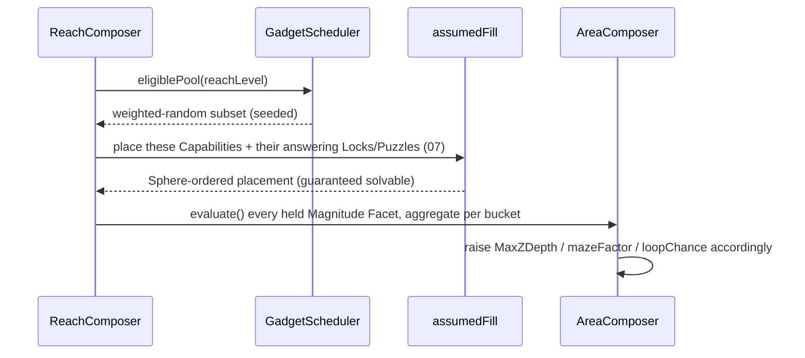

# 03 · Gadgets & Capabilities (game-agnostic by contract)

> How CycleVania reacts to Gadgets — shifting geometry, budgets, and placement odds around them —
> **without ever knowing what they actually do in gameplay terms**, including the hard corner
> cases: a capability whose effect depends on a resource pool, one with several independent
> progressive-upgrade tiers, one that only matters in combination with another, and a single
> Gadget with several unrelated uses. **Puzzles and Locks get the identical treatment, as their own
> first-class, equally-important pool — see [07 · Puzzles & challenges](./07-puzzles-and-challenges.md).**
> This doc is Capabilities only; 07 is everything a Capability unlocks *access to*.

## Why a static profile doesn't survive contact with real Gadgets

A previous revision of this doc modeled a Capability's effect as a static bundle of named number
fields (`verticalReach`, `gapSpan`, …). That's already too committed to a *shape*: a plain number
can't distinguish a flat double-jump from a space-jump that's metered by a consumable, can't
express "this only matters combined with a second capability," and can't represent one Gadget
(a Hammer that smashes walls, flips enemies, *and* hits harder in combat) whose several effects
should be independently placeable, upgradeable, or gateable. Fixed dials are exactly the kind of
game-specific commitment CycleVania has to avoid — so the fix isn't a bigger bundle of dials, it's
changing *what kind of thing* a Capability's effect is.

## The fix: Capabilities carry Facets, and Facets are evaluated, not stored

```ts
type CapabilityId = string;   // opaque — CycleVania never inspects it, e.g. "wall-climb"

interface CapabilityDef {
  id: CapabilityId;
  /** Most Capabilities are "granted" directly by a Gadget's pickup. A Capability whose
   *  held-state is *derived* from others is how combos work — see below. */
  held: "granted" | { derivedFrom: CapabilityId[]; minLevels?: Partial<Record<CapabilityId, number>> };
  facets: Facet[];                        // zero or more — see the three shapes below
  powerWeight: (level: number) => number; // 0..1 — drives the scheduler further down. Required:
                                           // there's nothing left to estimate it *from* once static
                                           // dials are gone, so the host must state it directly.
  guarantee?: { withinReachLevels: number }; // optional pity window — see "Progression-item
                                           // frequency" below
  category?: string;                      // free-form, host-only label — CycleVania stores this,
                                           // never interprets it (see "Categorization" below).
}
type Facet = MagnitudeFacet | TagFacet | ResourceFacet;
```

Every Facet's `evaluate` receives the same small, game-agnostic context — this is the *only* thing
CycleVania ever hands back to host code, and it's deliberately thin:

```ts
interface FacetContext {
  level: number;                             // how many times this Capability has been granted so far
  resource?: { charge: number; capacity: number };  // present only if a ResourceFacet shares this id
  held: ReadonlySet<CapabilityId>;           // everything currently held — for combo-sensitive logic
}
```

### The three Facet shapes — and why exactly these three

Every way a Capability can matter to generation reduces to one of three answer-shapes: *how much*,
*can this specific thing happen here*, or *what pool does this draw from*. Three Facet kinds, one
per shape:

```ts
interface MagnitudeFacet {
  kind: "magnitude";
  bucket: BuiltinBucket | `custom.${string}`;   // which budget this feeds — see below
  evaluate(ctx: FacetContext): number;          // an effective magnitude, in CycleVania's own units
}

interface TagFacet {
  kind: "tag";
  tag: string;                        // shared vocabulary with Socket.signature / PuzzleDef.spatialRecipe (04, 07)
  evaluate?(ctx: FacetContext): boolean;  // optional — omit for "always active once held"
}

interface ResourceFacet {
  kind: "resource";
  poolId: string;                                // several Capabilities may share one pool
  capacity(ctx: FacetContext): number;           // max charge at the current level
  regenHint: "site" | "time" | "kill" | "none";  // a *categorical* placement hint, never a rate
}
```

- **Magnitude** feeds a named **bucket** — a budget bucket CycleVania (or the host's own downstream
  systems) already reads, like `MaxZDepth` or an enemy-difficulty budget. `bucket` is either one of
  a small closed set CycleVania's own L2 math consumes directly (`traversal.zUp`, `traversal.zDown`,
  `traversal.xyGap`, `traversal.permeate`, `traversal.perceive`, `traversal.timeHazard`,
  `traversal.weight`, `challenge.offense`, `challenge.defense`), or a `custom.*`-namespaced id the
  host's own systems read (same escape-hatch shape as `DialPatch.custom` in
  [02](./02-composers-and-complexity.md)).

  **The crucial boundary**: `evaluate()` must return a number already expressed in *CycleVania's*
  world units for that bucket (e.g. voxel cells of vertical clearance) — not the game's own units
  (meters of jump height, frames of hang-time). Converting is entirely the host's job inside the
  callback, because only the host knows the conversion factor between its physics and CycleVania's
  grid. This is exactly how "we know the jump height, CycleVania doesn't" gets resolved: the host
  keeps that knowledge and performs the conversion once, at the boundary, instead of CycleVania
  ever needing a `jumpHeight` field.

- **Tag** answers "can this specific environment feature exist/activate here" — a boolean (or
  omitted, meaning always-true-once-held), never a magnitude. This is how a wall-smash, a
  telekinesis-liftable prop, or a hidden-passage reveal gets tied to actual geometry: the `tag`
  string is looked up against a Socket's `signature`/`revealable` flag or a `PuzzleDef`'s
  `spatialRecipe` (see [04](./04-spatial-composition-and-sockets.md),
  [07](./07-puzzles-and-challenges.md)) — one shared vocabulary, not three parallel systems.

- **Resource** describes a consumable pool without CycleVania ever simulating it. `regenHint` is
  deliberately categorical rather than a numeric rate: CycleVania only needs to decide, at
  generation time, whether `AreaComposer` should scatter refill-anchor Sockets (`"site"`) — the
  actual tick/regen simulation is 100% host runtime code CycleVania never touches.

## Progressive upgrades — a level is just repeated grants

A capability's `level` isn't a separate mechanism — it's simply how many times a Gadget referencing
that same `CapabilityId` has been placed and held. `MagnitudeFacet.evaluate` (and any Facet) reads
`ctx.level` directly, so a double-jump that becomes a triple-jump that becomes a continuous
space-jump is one `CapabilityDef` whose `evaluate` returns a bigger (or unbounded) number as
`ctx.level` climbs — no new plumbing required. This is also precisely what `count(cap, n)` in
[01](./01-mission-graph.md)'s Rule algebra already expresses: a Lock requiring "this capability at
level ≥ n" is `count(cap, n)`, unchanged from the original Rule design.

## Combos — a Capability whose *held* state is derived, not granted

Two capabilities that only matter together (reading a cryptic language **and** being able to
rearrange it) don't need a fourth Facet kind — they need a **derived** `CapabilityDef`:

```ts
{
  id: "read-hidden-passage",
  held: { derivedFrom: ["translate-language", "rearrange-glyphs"] },
  facets: [{ kind: "tag", tag: "reveal-glyph-passage" }],
  powerWeight: () => 0.6,
}
```

Nothing grants `read-hidden-passage` directly; it becomes `held` automatically once both
prerequisites are. Use this route when the combo itself deserves its own Facets (extra geometry
tagging, its own scheduling weight); when a combo is *purely* a gating requirement with no
Facets of its own, a plain `and(have(a), have(b))` Rule on the edge (see
[01](./01-mission-graph.md)) is simpler and equivalent.

## Multi-use Gadgets — three independent axes of bundling

A single fictional item (a Hammer that smashes walls, flips enemies, and hits harder in combat)
can be modeled three different ways, and CycleVania supports all three because bundling happens at
two independent levels — Facets-per-Capability, and Capabilities-per-Gadget:

| Bundling choice | Shape | When to use it |
|---|---|---|
| One Capability, one Facet | the simple case | a single effect |
| One Capability, **many Facets** | all effects always gated/placed together | the effects should never be separable — one pickup, one Sphere placement, all effects active at once |
| One Gadget, **many Capabilities** | effects independently placeable, upgradeable, or Lock-gated | a boss might require *specifically* the flip-effect without caring about the smash-effect |

```ts
// Option A — one pickup, three effects, always together:
{ id: "megaton-hammer", held: "granted", powerWeight: () => 0.7, facets: [
  { kind: "tag", tag: "smash-stone" },
  { kind: "tag", tag: "flip-heavy-enemy" },
  { kind: "magnitude", bucket: "challenge.offense", evaluate: () => 0.6 },
]}

// Option B — one Gadget, three independently-gateable Capabilities:
// GadgetDef { id: "megaton-hammer", grants: ["hammer-smash", "hammer-flip", "hammer-combat"] }
```

Neither option is "more correct" — it's a host authoring decision, and CycleVania's data model
doesn't force either shape.

## Putting it all together — the worked example from the brief

| Variant | Facets on `air-jump` | Where the variance comes from |
|---|---|---|
| Simple double-jump | one `MagnitudeFacet(bucket: "traversal.zUp", evaluate: () => 2 * JUMP_UNIT)` | a constant — level never changes |
| Progressive (double → triple → space-jump) | same Facet, `evaluate: ctx => ctx.level * JUMP_UNIT` | `ctx.level` climbs with each upgrade pickup |
| Space-jump metered by a consumable | + `ResourceFacet(poolId: "jump-charge", capacity: ctx => 3 + ctx.level, regenHint: "site")`; the Magnitude Facet folds `ctx.resource` into a conservative sustained value | two Facets on one Capability |
| All three, as progressive upgrades to one Gadget | the same `CapabilityDef`, upgraded via repeated grants | level accumulation (above) does this automatically |

CycleVania never sees "jump" anywhere in this table — only a bucket id, a level counter, and a
resource pool, all fed by host code.

## Categorization — why CycleVania doesn't ship gameplay-flavor categories

The brief's suggested split (`Essential Movement`, `Combat & Offensive`, `World & Passive`) is a
reasonable way for a *host* to organize *their own* catalog file — but CycleVania's own structural
separation of concerns is deliberately different, and by a different axis: not "what flavor of
ability is this" but **"which of the three Facet shapes is it, and which bucket does it feed"**.
The reason is exactly the Hammer example above: a single fictional Gadget routinely spans what
would be three "flavor" categories (movement-adjacent, combat, environment-puzzle) at once, so a
one-category-per-Capability tag would constantly need to be violated or split arbitrarily. Facets
already solve this — a Capability just *has* however many Facets of however many kinds it needs.

`CapabilityDef.category` exists precisely so a host can still keep their own flavor-based grouping
for authoring-tool/UI purposes — CycleVania stores the string and never branches on it.

## The weighted, entropy-scaled placement scheduler

This is shared machinery — [07](./07-puzzles-and-challenges.md)'s Puzzle pool is scheduled by the
*identical* mechanism below, just against its own catalog, economy config, and RNG fork namespace,
so the two pools never compete for the same entropy or accidentally correlate:

```ts
function eligibility(reachLevel: number, powerWeight: number): number {
  // logistic curve shifted right by powerWeight — low power ≈ eligible immediately,
  // high power ≈ needs several ReachLevels before it becomes likely.
  const midpoint = powerWeight * MAX_LEVEL_SHIFT;
  return 1 / (1 + Math.exp(-(reachLevel - midpoint) / SOFTNESS));
}
```

- Sampled as a **probability** from `rng.fork("gadget-schedule")` — never a hard gate. This is what
  makes "a wall-scaling ability should be less likely to appear early, but not impossible" true: a
  `powerWeight = 0.9` Capability has low-but-nonzero eligibility at `ReachLevel = 0`, and across
  many seeds will rarely, legitimately, show up early.
- The *same* curve governs an upgrade's later grant events too — evaluated at
  `powerWeight(currentLevel)` for whichever level is about to be granted next, so a third upgrade
  tier of an already-powerful Capability is itself scheduled later, using the identical mechanism as
  a first pickup.
- A Capability and the Lock/Puzzle that answers it ([07](./07-puzzles-and-challenges.md)) are
  scheduled by their own respective curves but drawn independently enough that `assumedFill` (see
  [01](./01-mission-graph.md)) is always free to place the Capability in an *earlier* Sphere than
  the Puzzle that needs it — never the reverse.
- Once a Capability clears its eligibility roll, its currently-held Magnitude Facets are evaluated
  and aggregated **per bucket** into that Reach's running budget, which `AreaComposer` reads when
  deriving `MaxZDepth`, `mazeFactor`, etc. (see [02](./02-composers-and-complexity.md)) — this is the
  literal mechanism by which "gaining verticality makes later Areas more vertical."



## Progression-item frequency: min, max, and a "guaranteed eventually" pity system

### The baseline: `GadgetEconomyConfig`

```ts
interface GadgetEconomyConfig {
  min: number;   // progression items placed per Reach — default 1, never lower without an explicit override
  max: number;
}
```

This is host-supplied registry data, adjustable at two independent points already established
elsewhere — both exist because "how often progression items appear" is something the *player* and
the *host* might each legitimately want to steer, separately: a Reach modifier's
`dials.gadgetEconomy` ([02](./02-composers-and-complexity.md)) is the player's lever, chosen before
a Reach generates; `ReachRequest.gadgetEconomyOverride` ([02](./02-composers-and-complexity.md)) is
the host's own lever, settable at the exact moment of requesting a Reach, independent of and
stacking with whatever the player picked. **`PuzzleEconomyConfig` is the identical shape, applied to
the Puzzle pool instead — see [07](./07-puzzles-and-challenges.md); the two economies are configured
and tuned completely independently.**

### The registry is the only place new Capabilities can come from

**Every Capability that could ever possibly be placed, in any Reach, at any depth, must already
exist in the `GadgetCatalog` registry supplied at World-construction time — CycleVania never
invents one mid-generation.** This is a determinism requirement, not a style preference: the
scheduler's eligible pool at Reach `i` is "every catalog Capability not yet placed in Reaches
`0..i-1`," and for that to be reproducible from `(WorldSeed, ReachRequestLog)` alone, the *starting*
catalog it draws from has to be fixed, seed-independent data — never invented per seed or per Reach.
The identical rule applies to the Puzzle catalog in [07](./07-puzzles-and-challenges.md).

### Not every registered Capability has to be placed

A World is under no obligation to place every catalog entry. A short World might place only the
dozen Capabilities its own Puzzles/Locks actually reference; a long one might eventually place all
of them. This is safe by construction, not by luck: a Lock can only ever reference a Capability
once that Capability is already part of *some* Reach's own item list (its own, or an earlier
Reach's, via the `startHeld` argument in [01](./01-mission-graph.md)) — there's no mechanism by
which a Lock could reference a Capability that's never been scheduled anywhere, so an unplaced
registry entry never threatens solvability. It simply never gates anything, in that particular
World.

### Guaranteeing a Capability shows up *eventually*

The eligibility curve alone only ever makes early placement *unlikely* for a high-power Capability
— it never *forces* placement. For a Capability the host wants to promise will exist somewhere,
given enough Reach generations, add a **pity window**:

```ts
interface CapabilityDef {
  // ...as defined above, plus:
  guarantee?: { withinReachLevels: number };
  // if still unplaced this many ReachLevels after first becoming eligible, force it at the next
  // opportunity. powerWeight already controls *when it's likely*; guarantee only bounds *how late
  // it can possibly be*.
}
```

```ts
function eligibility(reachLevel, powerWeight, reachLevelsSinceEligible, guarantee): number {
  const base = logistic(/* unchanged from above */);
  if (guarantee && reachLevelsSinceEligible >= guarantee.withinReachLevels) return 1;  // forced
  return base;
}
```

A pity-forced placement is exempt from that Reach's `GadgetEconomyConfig.max` (a determinism/design
promise should never be silently dropped for budget reasons) but still counts toward its `min`.
`reachLevelsSinceEligible` is computed purely from realized history (`minDepth` vs. current depth),
so this stays fully deterministic under the same `(WorldSeed, ReachRequestLog)` reproducibility
unit as everything in [02](./02-composers-and-complexity.md).

### Pity is the fallback; the virtual schedule is the plan, when a World is bounded

`guarantee.withinReachLevels` above is a **local, per-Capability, always-available** safety net —
it works even in a World with no declared length at all. When a host *does* bound
`WorldLengthPolicy` ([02](./02-composers-and-complexity.md)), CycleVania can do better than a
per-Capability safety net: `WorldComposer` pre-computes a **virtual schedule** — a one-time,
pure-function plan of roughly which Reach each catalog Capability should land in, spread evenly
across however many Reaches the World will actually have — and that plan is what the real
per-Reach eligibility roll biases toward first, with `guarantee` remaining underneath it as the
backstop for anything the plan didn't anticipate. The World's *actual final Reach* then performs a
mandatory sweep of anything still unplaced, which is a strictly stronger promise than pity alone
can make (pity only bounds "how late," the final sweep bounds "definitely by the declared end").
See [02](./02-composers-and-complexity.md)'s "How many Reaches should a World have?" for the full
mechanism, including why the degenerate `WorldLengthPolicy = { min: 1, max: 1 }` case collapses into
placing every Capability immediately, with no scheduling drama at all. **The Puzzle pool gets its
own, independent virtual schedule and final sweep, running alongside this one — see
[07](./07-puzzles-and-challenges.md).**

### What this does — and doesn't — guarantee about "beating the world"

Chaining these together: every registry Capability either never gets placed (and never gates
anything, so it's moot) or gets placed within a bounded number of Reach generations (via
`guarantee`), and every Reach is solvable given its concrete `startHeld` (see
[01](./01-mission-graph.md)). So if a host declares some terminal condition — a final Reach, a
`MaxReachCount` — its requirements stay satisfiable as long as every Capability it could reference
has a bounded worst-case placement depth. This is a **logical/topological** guarantee only, exactly
per [01](./01-mission-graph.md)'s closing note: CycleVania has no model of a player's power level,
so it cannot and does not promise a Reach is *survivable* at the depth it's reachable — only that
it's *reachable*, always, given enough on-demand generation.

## Registries a host supplies

| Registry | Shape | Consumed by |
|---|---|---|
| `GadgetCatalog` | `CapabilityDef[]` + `GadgetDef[]` (`{ id, grants: CapabilityId[] }`) | scheduler (this doc), `AreaComposer` budget (02) |
| `GadgetEconomyConfig` | `{ min, max }` progression items per Reach | scheduler (this doc) — adjustable via a modifier's `dials.gadgetEconomy` or `ReachRequest.gadgetEconomyOverride` (02) |

`CustomAffordanceHandler` from an earlier revision of this doc is **superseded** by the Facet model
above — a host-custom dial is now just a `MagnitudeFacet` targeting a `custom.*` bucket, evaluated
per-Capability rather than registered once globally. This is deliberately one of only two places
gameplay-specific knowledge enters the whole pipeline (the other being
[07](./07-puzzles-and-challenges.md)) — every other doc in this folder can be read, and every
algorithm in them exercised, without ever knowing a single real Gadget name.

## Note: Reach modifiers are not Gadgets

[02](./02-composers-and-complexity.md) introduces a second, easily-confused mechanism — **Reach
modifiers** — so it's worth being explicit about the boundary. A **Gadget/Capability** changes what
the *player* can physically do (Facets the mission graph gates on and the space budget reacts to);
a **Reach modifier** changes what the *generator's dials* are set to for one Reach (a risk/reward
choice the player makes *before* generation, via a `DialPatch`). A Gadget is discovered *during* a
Reach and persists forward; a Reach modifier is chosen *before* a Reach and applies only to that one
generation call. They can still interact — a modifier's `dials.gadgetEconomy` can widen or narrow
that Reach's gadget draw (see [02](./02-composers-and-complexity.md)) — but they are never the same
knob.
