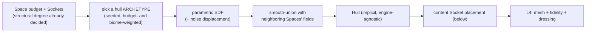

# 04 · Spatial composition & sockets (L3 — organic volume)

> How an abstract Space (a budget + a set of Sockets, from L2) becomes an actual organic 3D hull,
> how one small primitive — the **Socket** — does triple duty as connectivity, WFC-style
> compatibility, and content-spawn anchoring, how many connections a Space is allowed to have, and
> how content actually gets scattered across a hull without anything overlapping.

## `SpaceComposer` and its three subclasses

```ts
abstract class SpaceComposer {
  constructor(protected budget: SpaceBudget, protected sockets: Socket[]) {}
  abstract composeHull(): Hull;
}
```

| Subclass | Adds | Typical use |
|---|---|---|
| `RoomComposer` | interior hull + content-anchor layout | enclosed rooms, chambers, boss arenas (indoor) |
| `OutdoorComposer` | + terrain heightfield, sea/water level, vista sightline placement, handmade-asset anchors | open-air Areas, boss arenas (outdoor) |
| `ConnectorComposer` | a spline/tube hull between exactly two Sockets | halls, shafts, curved tunnels, vertical drops |

All three consume the same `SpaceBudget` contract (a voxel-scale volume ceiling + a poly/complexity
allowance, **plus a connectivity-degree range — see below**) and emit the same output shape — an
engine-agnostic **Hull** (a boundary description, not a mesh) that L4 naturalizes into real
geometry. Nothing downstream needs to know which subclass produced a given Hull.

## The Socket — one primitive, three jobs

```ts
interface Socket {
  id: string;
  pos: Vec3; dir: Vec3;                 // world position + outward-facing direction
  kind: "structural" | "content";       // connects Spaces, or anchors decoration
  traversal?: "walk" | "climb" | "crawl" | "drop" | "swim" | "vertical";
  signature: string;                    // compatibility tag for WFC-style matching (below)
  gate?: Rule;                          // optional Lock, if this Socket is gated (see 03)
}
```

A **structural** Socket is a connection point between two Spaces — `ConnectorComposer` grows a
hull between a pair of them. A **content** Socket is the exact same shape used for a light, prop,
or gadget-pickup anchor — decoration is not a bolted-on second system, it reuses the identical
placement/compatibility plumbing as structural connections, which is what keeps dressing
*diegetic* (an anchor is always a real point on real geometry, never a floating decoration).

### Why `signature` matters — Sockets as a lightweight WFC

Rather than hand-authoring an adjacency table for every possible Room-shape × Room-shape pairing
(which explodes combinatorially and is the single biggest source of "obviously proc-gen" seams),
every Socket carries a short compatibility `signature` (e.g. `"wide-arch|floor-level"`). When
`AreaComposer` wires two Spaces together, it only considers Socket pairs whose signatures are
compatible — a minimal Wave-Function-Collapse-style local constraint, cheap to check, that
guarantees a hall never plugs into a mismatched opening. The same signature system governs which
*kit piece* (see below) a `RoomComposer` may choose for a given cell — connectivity-WFC and
content-WFC are the same constraint solved at two different grain sizes.

## How many connections should a Space have?

Every Space's `SpaceBudget` carries a host-tunable **connectivity-degree range**,
`{ min: number; max: number }`, bounding how many *structural* Sockets it's allowed to grow —
this is what decides whether a Space is a strict pass-through or a many-armed hub, and it should
default differently per Space `kind`, not be one global constant:

| Space kind (illustrative) | typical degree range | why |
|---|---|---|
| `corridor`/connector | exactly 2 | it exists to join exactly two things |
| ordinary room | 2–3 | one way in, one or two ways onward — the metroidvania default |
| `hub` | 3–6 | deliberately a decision point; more exits *is* the point |
| `vault` / dead end | 1 | a dead end by design, not a bug |
| large open landmark Space | up to a host-declared ceiling (e.g. 6–8) | see below |

**A single large cylindrical room (or a big outdoor bowl) with entrances/exits in several
directions is a legitimate, often-desirable pattern** — it's exactly the kind of memorable,
"lay of the land" hub the brief's Metroid Prime/Zelda inspiration calls for: a central chamber a
player re-recognizes every time they pass through, however they entered. CycleVania should allow
it, but **bounded**, for two structural reasons, not just aesthetic ones:

1. **Combinatorial cost** — every extra Socket is another `signature`-compatibility check
   `AreaComposer` has to solve when wiring the rest of the Area; an unbounded-degree room turns a
   linear wiring pass into a much harder constraint problem.
2. **Reachability legibility** — a Region with too many neighbors makes the mission graph (L1)
   harder to reason about, both for solvability tooling and for a human skimming a template; a
   `maxDegree` ceiling keeps branching factor sane no matter how organic the *geometry* gets.

So: **allow it, and bound it — via a host-declared `maxDegree` per Space `kind`**, never a
CycleVania-hardcoded constant. `AreaComposer` rolls each Space's actual degree within its kind's
range, seeded, biased by role (a `hub`-role Space rolls toward the high end more often than a
`segment`-role Space does).

## Organic hull generation (the recommended approach)

The strongest pattern for "organic, not boxy" is a **signed-distance-field (SDF) volumetric**
approach: represent each Space's open volume as an implicit function (negative = walkable, positive
= solid), union multiple primitive/noise-displaced SDFs together for a single Space's hull, join
neighboring Spaces' fields with a **smooth union** (so touching rooms blend at their seams instead
of showing a hard cut), and only convert to an explicit mesh (dual contouring, or your engine's
equivalent) as the very last step. This keeps every intermediate decision cheap, resolution-
independent, and trivially combinable — noise-warping, biome-driven displacement, and
smooth-blending are all just SDF operations, not mesh-editing operations.



This is a *recommendation*, not a mandate — any volumetric technique that can (a) blend smoothly at
seams and (b) stay resolution-independent until the final naturalization step satisfies the
contract equally well.

## Placing content Sockets inside a Space

A distinct problem from *how many structural Sockets* a Space has: once a Hull exists, something
still has to decide where lights, props, interactables, and dressing actually sit on it — without
overlapping each other or blocking a doorway.

### Classify the surface first

A Hull is an implicit boundary, so any candidate point on it has a well-defined local outward
normal — classify that into a `SurfaceKind`:

```ts
type SurfaceKind = "floor" | "wall" | "ceiling" | "slope" | "overhang";
// normal.up beyond some cone -> floor; near-horizontal -> wall;
// normal.down beyond some cone -> ceiling; anything between -> slope / overhang
```

This is representation-agnostic — it only needs a normal at a point, so it works regardless of
whether L3 happens to be SDF-based or something else entirely.

### Scatter, don't hand-place

The right algorithm is **Poisson-disk sampling over the classified surface** (Bridson's algorithm,
or plain rejection sampling for a first pass — both fully deterministic given a forked RNG):
propose a candidate point on an allowed surface, accept it only if it's at least `minSeparation`
from every already-accepted anchor *and* every structural Socket, reject and retry otherwise, stop
at a target density or attempt budget. Both dials are **per content-anchor kind**, not global — a
floor scattered with rubble wants tight packing; landmark anchors want to stay sparse (matching the
sparsity goal in "Landmarks," below):

```ts
interface ContentAnchorKind {
  id: "light" | "prop" | "interactable" | "dressing" | "landmark-feature" | "gadget-pickup";
  allowedSurfaces: SurfaceKind[];
  minSeparation: number;            // this kind's own personal-space radius, world units
  clearanceFromStructural: number;  // extra buffer kept around every structural Socket/doorway
  targetDensity: number;            // anchors per unit hull area (or per-Space, for sparse kinds)
}
```

### Suggesting what occupies an anchor

A content Socket's `kind` *is* the suggestion mechanism — the same string vocabulary a `TagFacet` or
a `PuzzleDef.spatialRecipe` already matches against (see
[03](./03-locks-keys-and-gadgets.md), [07](./07-puzzles-and-challenges.md)), so "what should occupy
this anchor" falls out of the same signature-matching CycleVania already does for structural
Sockets, not a fourth parallel system: a `gadget-pickup` anchor is where `assumedFill`'s chosen
Location resolves to; an `interactable` anchor is where a `PuzzleDef`'s `spatialRecipe` gets its
physical alcove; a `landmark-feature` anchor is where the cross-Space-visibility bias below actually
lands; `light` and `dressing` anchors have no gameplay tie-in at all and are purely the host
realizer's to fill however
it likes.

### No overlap, ever

Overlap prevention is the same Poisson-disk rejection step, checked against three things at once:
every already-accepted anchor *of any kind* (a prop shouldn't spawn inside a light's clearance
either), every structural Socket's `clearanceFromStructural` buffer, and — cheaply, since the Hull's
distance field already exists — the Hull boundary itself (reject any candidate whose bounding
radius would poke back through the surface, reusing the same `sdf(p)` evaluation the Hull is
already built from). Nothing here needs a second geometry pass; everything is rejection-tested
against representations that already exist by this point in the pipeline.

## Landmarks — designing for memorability, not just variety

A generator that only varies room *shape* still produces a world nobody can mentally map. The
brief explicitly wants Metroid Prime / Zelda-grade "lay of the land" recall, which needs a
deliberate, sparse pattern on top of ordinary variety:

- Each Reach places **1–2 landmark hulls** — larger, more distinctive silhouettes than ordinary
  Spaces, typically at the high end of the connectivity-degree range above (hand-authored
  escape-hatch shapes are welcome here; procedural variety alone tends to read as "big room," not
  "landmark").
- Landmark placement is biased toward **cross-Space visibility** — picking a position and hull
  scale such that its silhouette is actually visible (line-of-sight against the composed field)
  from multiple other Spaces, not just from inside itself. This is the concrete mechanism behind
  "orient yourself by a tower/chasm/glow you can see from three different rooms."
- A landmark is a natural home for a `landmark-feature` or `gadget-pickup` content anchor — tying
  memorability directly to progression, rather than treating landmarks as pure set-dressing.

## Biomes — content packs, not palettes

A `BiomePack` is not just a color ramp — it bundles palette, per-surface materials, a hazard set
(feeding Lock pattern #11, [07](./07-puzzles-and-challenges.md)), an allowed dressing set, and surface
noise parameters that feed hull displacement. Two refinements worth building in from day one:

- **Sub-biome gradient blending** — an Area can blend two `BiomePack`s across its extent (a weight
  field, not a hard region cut), so a transition from "cave" to "overgrown cave" reads as a
  gradient a player discovers, not a seam they notice.
- **Modifier-adjusted hazard density** — a chosen Reach modifier's `dials.hazard.densityMul` (see
  [02](./02-composers-and-complexity.md)) scales this straightforwardly; a risky modifier is what
  turns an ordinary hazard set into a genuinely dangerous one for that one Reach.
- **Per-Area palette/hazard variance** — even within one biome id, each Area samples a small seeded
  deviation in its parameters (per [02](./02-composers-and-complexity.md)'s "two Areas in the same
  Reach shouldn't look identical").

## What L4 (naturalization/finish) is responsible for

Strictly downstream of everything above, and strictly a *finishing* concern — it never makes
structural decisions:

- Converting the implicit Hull(s) into an explicit, engine-agnostic mesh at whatever surface
  fidelity your target look calls for (faceted low-poly, smooth high-poly, or anything between).
- Deduplicating repeated local geometry into a small reusable kit + placement instances (keeps
  memory/asset-count bounded regardless of world size).
- Emitting a serializable collision/occupancy representation alongside the visual mesh.
- Instantiating already-placed content Socket anchors (dressing, props, gadget pickups) as data,
  never as meshes — the host's realizer decides what actually spawns at each anchor.

Because L4 only *finishes* what L1–L3 already decided, swapping fidelity targets (PS1-chic,
smooth-organic, voxel) never touches solvability, layout, Lock placement, or Socket placement — it
is purely a render-style choice.
